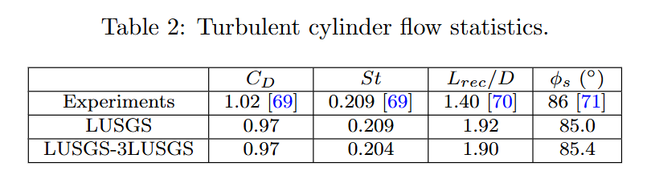

## ILES

ILES: Solving N-S directly, not adding explicit (PDE) terms.

## Circular Cylinder: Experiments

> Aljure, D. E., et al. "Three dimensionality in the wake of the flow around a circular cylinder at Reynolds number 5000." Computers & Fluids 147 (2017): 102-118.

> Norberg, Christoffer. "Flow around a circular cylinder: aspects of fluctuating lift." Journal of fluids and structures 15.3-4 (2001): 459-469.

> Norberg, Christoffer. "Pressure forces on a circular cylinder in cross flow." Bluff-Body Wakes, Dynamics and Instabilities: IUTAM Symposium, Göttingen, Germany September 7–11, 1992. Berlin, Heidelberg: Springer Berlin Heidelberg, 1993.


## Current results




Mach number at $z=4$, time averaged, LUSGS:


Mach number at $z=4$, time averaged, LUSGS-3LUSGS:


Pressure and streamline at $z=4$, time averaged, LUSGS:


Pressure=71, time averaged, LUSGS:


Q=0.5, dt=0.05:


Q=0.5, dt=0.20:


### Drag coefficient


ILES starting runs:


ILES restarted runs:


| Case                                                                               | $C_d$      | error  | i0    |
| ---------------------------------------------------------------------------------- | ---------- | ------ | ----- |
| CylinderB1_L8U2_Rawstart2_PdT05_restart1_TH3_.log                                  | 1.2832e+00 | 2632.4 | 19500 |
| CylinderB1_L8U2_Rawstart2_PdT05_restart2_TH3_IDDES0_.log                           | 1.3274e+00 | 3073.8 | 19500 |
| CylinderB1_L8U2_Rawstart2_PdT05_restart2_TH3_IDDES0_O4_.log                        | 1.1953e+00 | 1752.9 | 19500 |
| CylinderB1_L8U2_Rawstart3_PdT05_TH3_ILES_O4_.log                                   | 1.0679e+00 | 479.0  | 19500 |
| CylinderB1_L8U2_Rawstart4_PdT05_TH3_ILES_dF02R_O4_.log                             | 1.0537e+00 | 337.1  | 13107 |
| CylinderB1_L8U2_Rawstart4_PdT05_TH3_ILES_dF02R_O4_GW2_.log                         | 9.8597e-01 | -340.3 | 19500 |
| CylinderB1_L8U2_Raw4dT05_TH3_ILES_dF02R_O4_GW2_O45_res0_JC1it0_TH4_MG44_L_.log     | 9.9673e-01 | -232.7 | 500   |
| CylinderB1_L8U2_Raw4dT05_TH3_ILES_dF02R_O4_GW2_O45_res0_JC1it0_TH4_MG4_L_.log      | 9.6334e-01 | -566.6 | 500   |
| CylinderB1_L8U2_Raw4dT05_TH3_ILES_dF02R_O4_GW2_O45_res0_JC1it0_TH4_L_.log          | 9.7306e-01 | -469.4 | 500   |
| CylinderB1_L8U2_Raw4dT05_TH3_ILES_dF02R_O4_GW2_O45_res0_JC1it0_dT05_A_.log         | 9.6862e-01 | -513.8 | 1500  |
| CylinderB1_L8U2_Raw4dT05_TH3_ILES_dF02R_O4_GW2_O45_res0_JC1it0_dT05_MG4_A_.log     | 9.8024e-01 | -397.6 | 1500  |
| CylinderB1_L8U2_Raw4dT05_TH3_ILES_dF02R_O4_GW2_O45_res0_JC1it0_dT20_TH4_A_.log     | 9.6582e-01 | -541.8 | 117   |
| CylinderB1_L8U2_Raw4dT05_TH3_ILES_dF02R_O4_GW2_O45_res0_JC1it0_dT20_TH4_MG4_A_.log | 9.7331e-01 | -466.9 | 500   |
| CylinderB1_L8U2_Rawstart4_PdT05_TH3_IDDES3RR1_.log                                 | 1.2830e+00 | 2629.8 | 19500 |
| CylinderB1_L8U2_Rawstart4_PdT05_TH3_IDDES3RR1_dF02_.log                            | 1.2844e+00 | 2643.8 | 19086 |
| CylinderB1_L8U2_Rawstart4_PdT05_TH3_IDDES5RR2_.log                                 | 1.2884e+00 | 2684.5 | 19500 |
| CylinderB1_L8U2_Rawstart4_PdT05_TH3_IDDES3RR2_.log                                 | 1.2652e+00 | 2452.1 | 19500 |
| CylinderB1_L8U2_Rawstart4_PdT05_TH3_IDDES3RR2_O4_.log                              | 1.1195e+00 | 995.0  | 19323 |
| CylinderB1_L8U2_Rawstart4_PdT05_TH3_IDDES3RR2_dF02_O4_.log                         | 1.1081e+00 | 881.1  | 12020 |
| CylinderB1_L8U2_Rawstart4_PdT05_TH3_IDDES3R_O4_.log                                | 1.2439e+00 | 2239.3 | 19500 |
| CylinderB1_L8U2_Rawstart4_PdT05_TH3_IDDES3R_dF02_.log                              | 1.2660e+00 | 2460.0 | 19170 |
| CylinderB1_L8U2_Rawstart4_PdT05_TH3_IDDES3R_.log                                   | 1.3041e+00 | 2841.0 | 19500 |
| CylinderB1_L8U2_Raw4dT05_TH2_dF02_O4_GW2_.log                                      | 1.0571e+00 | 370.6  | 4239  |
| CylinderB1_L8U2_Raw4dT05_TH2_dF02_O4_.log                                          | 9.2391e-01 | -960.9 | 148   |
| CylinderB1_L8U2_Raw4dT05_TH2_O4_GW2_.log                                           | 1.1684e+00 | 1483.5 | 19500 |
| CylinderB1_L8U2_Raw4dT05_TH3_O4_GW2_.log                                           | 1.2978e+00 | 2778.0 | 19500 |
| CylinderB1_L8U2_Raw4dT05_TH3_O4_.log                                               | 1.2962e+00 | 2761.8 | 19500 |
| CylinderB1_L8U2_Raw4dT05_TH3R_O4_GW2_.log                                          | 1.3593e+00 | 3393.3 | 14320 |
| CylinderB1_L8U2_Raw4dT05_TH3R_O4_.log                                              | 1.2245e+00 | 2045.4 | 14371 |

### Lift coefficient

ILES starting runs:


ILES restart runs:


CL spectrum


``` bash
CylinderB1_L8U2_Rawstart3_PdT05_TH3_ILES_O4_.log                                                      ||| St = 0.195384
CylinderB1_L8U2_Rawstart4_PdT05_TH3_ILES_dF02R_O4_.log                                                ||| St = 0.185615
CylinderB1_L8U2_Rawstart4_PdT05_TH3_ILES_dF02R_O4_GW2_.log                                            ||| St = 0.205153
CylinderB1_L8U2_Raw4dT05_TH3_ILES_dF02R_O4_GW2_O45_res0_JC1it0_TH4_MG44_L_.log                        ||| St = 0.210158
CylinderB1_L8U2_Raw4dT05_TH3_ILES_dF02R_O4_GW2_O45_res0_JC1it0_TH4_MG4_L_.log                         ||| St = 0.20015
CylinderB1_L8U2_Raw4dT05_TH3_ILES_dF02R_O4_GW2_O45_res0_JC1it0_TH4_L_.log                             ||| St = 0.20015
CylinderB1_L8U2_Raw4dT05_TH3_ILES_dF02R_O4_GW2_O45_res0_JC1it0_dT05_A_.log                            ||| St = 0.210079
CylinderB1_L8U2_Raw4dT05_TH3_ILES_dF02R_O4_GW2_O45_res0_JC1it0_dT05_MG4_A_.log                        ||| St = 0.200075
CylinderB1_L8U2_Raw4dT05_TH3_ILES_dF02R_O4_GW2_O45_res0_JC1it0_dT20_TH4_A_.log                        ||| St = 0.20284
CylinderB1_L8U2_Raw4dT05_TH3_ILES_dF02R_O4_GW2_O45_res0_JC1it0_dT20_TH4_MG4_A_.log                    ||| St = 0.205154
====================

CylinderB1_L8U2_Rawstart3_PdT05_TH3_ILES_O4_.log                                                     ||| St_est1 = -0.196975, clrms = 0.16
CylinderB1_L8U2_Rawstart4_PdT05_TH3_ILES_dF02R_O4_.log                                               ||| St_est1 = -0.186727, clrms = 0.17
CylinderB1_L8U2_Rawstart4_PdT05_TH3_ILES_dF02R_O4_GW2_.log                                           ||| St_est1 = -0.199256, clrms = 0.048
CylinderB1_L8U2_Raw4dT05_TH3_ILES_dF02R_O4_GW2_O45_res0_JC1it0_TH4_MG44_L_.log                       ||| St_est1 = -0.20661, clrms = 0.062
CylinderB1_L8U2_Raw4dT05_TH3_ILES_dF02R_O4_GW2_O45_res0_JC1it0_TH4_MG4_L_.log                        ||| St_est1 = -0.200908, clrms = 0.044
CylinderB1_L8U2_Raw4dT05_TH3_ILES_dF02R_O4_GW2_O45_res0_JC1it0_TH4_L_.log                            ||| St_est1 = -0.20533, clrms = 0.044
CylinderB1_L8U2_Raw4dT05_TH3_ILES_dF02R_O4_GW2_O45_res0_JC1it0_dT05_A_.log                           ||| St_est1 = -0.209089, clrms = 0.046
CylinderB1_L8U2_Raw4dT05_TH3_ILES_dF02R_O4_GW2_O45_res0_JC1it0_dT05_MG4_A_.log                       ||| St_est1 = -0.204124, clrms = 0.054
CylinderB1_L8U2_Raw4dT05_TH3_ILES_dF02R_O4_GW2_O45_res0_JC1it0_dT20_TH4_A_.log                       ||| St_est1 = 0.20608, clrms = 0.05
CylinderB1_L8U2_Raw4dT05_TH3_ILES_dF02R_O4_GW2_O45_res0_JC1it0_dT20_TH4_MG4_A_.log                   ||| St_est1 = -0.204658, clrms = 0.066
```
