<!--  -->

## DES formulations

ChatGPT and Grok seem to understand DES and SA at an acceptable level.

---

### 🧩 1. **Original DES (SA-DES, 1997)**

**Reference:** Spalart, P. R., Jou, W. H., Strelets, M., & Allmaras, S. R. (1997). *Comments on the feasibility of LES for wings, and on a hybrid RANS/LES approach.*

* **Base model:** Spalart–Allmaras (RANS)
* **Modification:** The wall-distance term ( d ) in the destruction term of SA is replaced by
  \[
  \tilde{d} = \min(d, C_{DES} \Delta)
  \]
  where \( \Delta \) is the local grid length scale, and \( C_{DES} \approx 0.65 \).
* **Idea:** When the grid spacing becomes smaller than the local boundary-layer thickness (in separated regions), the model switches to LES mode by limiting the eddy viscosity length scale.

**Issue:** In attached boundary layers on coarse grids, \( \Delta < d \) may occur unintentionally, causing *grid-induced premature separation* (“modeled-stress depletion”).

---

### ⚙️ 2. **Delayed DES (DDES, 2006)**

**Reference:** Spalart, P. R., Deck, S., Shur, M. L., Squires, K. D., Strelets, M. K., & Travin, A. (2006). *A new version of detached-eddy simulation, resistant to ambiguous grid densities.*

* **Base model:** SA or SA-neg

* **Modification:** Introduces a *shielding function* \( f_d \) to delay the DES switch in attached boundary layers:
  \[
  d_{DDES} = d - f_d \max(0, d - C_{DES}\Delta)
  \]
  with \( f_d \to 1 \) in the boundary layer (RANS mode) and \( f_d \to 0 \) in separated flow (LES mode).

* **Benefit:** Prevents premature activation of LES inside attached layers.

---

### 🧮 3. **Improved Delayed DES (IDDES, 2009)**

**Reference:** Shur, M., Spalart, P. R., Strelets, M., & Travin, A. (2008/2009). *A hybrid RANS–LES approach with delayed-DES and wall-modeled LES capabilities.*

* **Base model:** SA or SA-neg
* **Modification:** Refines DDES by adding:

  * Improved length-scale blending for smoother RANS–LES transition.
  * Explicit *wall-modeling* capability for high-Reynolds-number wall-bounded flows (WMLES mode).
  * Dynamic filter width depending on wall distance and grid anisotropy.

**Use case:** Widely used in industrial CFD (e.g. ANSYS Fluent, OpenFOAM). Suitable for external aerodynamics.

---

### Original Spalart–Allmaras (SA) Turbulence Model  

#### With Linear Suppression Term \( f_{t2} \)

This document formulates the **Spalart–Allmaras one-equation turbulence model** including the **linear suppression (trip) term \( f_{t2} \)**. The formulation is consistent with the original SA model as used in early transition-sensitive and DES-capable implementations (e.g. SA, SA-neg, SA-DES).

---

#### 1. Transport Equation

The transported variable is the modified kinematic eddy viscosity \( \tilde{\nu} \).

$$
\frac{\partial \tilde{\nu}}{\partial t}+ u_j \frac{\partial \tilde{\nu}}{\partial x_j}=
P_{\tilde{\nu}}- D_{\tilde{\nu}}+ \frac{1}{\sigma}
\left[
\frac{\partial}{\partial x_j}
\left(
(\nu + \tilde{\nu})
\frac{\partial \tilde{\nu}}{\partial x_j}
\right)+ C_{b2}
\left(
\frac{\partial \tilde{\nu}}{\partial x_j}
\right)^2
\right]
$$

---

#### 2. Production Term (with \( f_{t2} \))

\[
P_{\tilde{\nu}}=
C_{b1}
(1 - f_{t2})
\tilde{S}
\tilde{\nu}
\]

The **linear suppression term \( f_{t2} \)** reduces turbulence production in laminar or transitional regions.

---

#### 3. Modified Vorticity Magnitude

\[
\tilde{S}=
S+
\frac{\tilde{\nu}}{\kappa^2 d^2}
f_{v2}
\]

where

\[
S = \sqrt{2 \Omega_{ij} \Omega_{ij}}
\]

---

#### 4. Destruction Term

\[
D_{\tilde{\nu}}=
C_{w1}
f_w
\left(
\frac{\tilde{\nu}}{d}
\right)^2
\]

---

#### 5. Eddy Viscosity Relation

\[
\nu_t = \tilde{\nu} f_{v1}
\]

with

\[
f_{v1}=
\frac{\chi^3}{\chi^3 + C_{v1}^3},
\qquad
\chi = \frac{\tilde{\nu}}{\nu}
\]

---

#### 6. Auxiliary Functions

##### 6.1 Viscous Damping Function

\[
f_{v2}=
1-
\frac{\chi}{1 + \chi f_{v1}}
\]

---

##### 6.2 Wall Destruction Function

\[
f_w=
g
\left[
\frac{1 + C_{w3}^6}{g^6 + C_{w3}^6}
\right]^{1/6}
\]

with

\[
g=
r
+
C_{w2}
(r^6 - r),
\qquad
r=
\frac{\tilde{\nu}}{\tilde{S} \kappa^2 d^2}
\]

---

#### 7. Linear Suppression Function \( f_{t2} \)

\[
f_{t2}=
C_{t3}
\exp(-C_{t4} \chi^2)
\]

This term:

* Appears **linearly** in the production term
* Suppresses turbulence growth in laminar regions
* Is typically **inactive in fully turbulent flows**
* Plays a role in **transition-sensitive** and **DES/IDDES ψ-modifications**

---

#### 8. Model Constants

| Constant     | Value                                       |
| ------------ | ------------------------------------------- |
| \( \sigma \) | \( 2/3 \)                                   |
| \( C_{b1} \) | 0.1355                                      |
| \( C_{b2} \) | 0.622                                       |
| \( \kappa \) | 0.41                                        |
| \( C_{v1} \) | 7.1                                         |
| \( C_{w1} \) | \( C_{b1}/\kappa^2 + (1 + C_{b2})/\sigma \) |
| \( C_{w2} \) | 0.3                                         |
| \( C_{w3} \) | 2.0                                         |
| \( C_{t3} \) | 1.2                                         |
| \( C_{t4} \) | 0.5                                         |

---

#### 9. Remarks

* The function \( f_{t2} \) is **optional** and often disabled in fully turbulent RANS.
* In **SA-DES / DDES / IDDES**, the wall distance \( d \) is replaced everywhere by a modified length scale.
* In **SA-neg**, the same formulation applies, but \( \tilde{\nu} \) is allowed to become negative with modified handling of \( f_{v1}, f_{v2}, f_w \).

---

### Rotation correction

<https://turbmodels.larc.nasa.gov/spalart.html#saR>

Spalart-Allmaras One-Equation Model with Rotation Correction (SA-R)

\[
P_{\tilde{\nu}}=
C_{b1}
(1 - f_{t2})
(\tilde{S} + C_{rot}\min(0,|\sigma|-S))
\tilde{\nu}
\]

Where strain rate magnitude $|\sigma| = \sqrt{2\sigma_{ij}\sigma_{ij}}$ and strain rate is $\sigma_{ij} = 1/2(\partial_i u_j + \partial_j u_i)$.

Note that production is allowed to be negative here and the recommended coefficient is $C_{rot} = 2$.

### Modified DES Length Scale

Shur, Mikhail L., et al. "A hybrid RANS-LES approach with delayed-DES and wall-modelled LES capabilities." International journal of heat and fluid flow 29.6 (2008): 1638-1649.

The **ψ-modified DES length** becomes:

\[
d_{DES}=
\min
\left(
d,
\;
\Psi \, C_{DES} \Delta
\right)
\]

Enlarges LES scale to maximum 10x when $f_{t2}$ is active.

or, in **DDES / IDDES shielding form**:

\[
d_{DDES}=
d-
f_d
\max
\left(
0,
\;
d - \Psi \, C_{DES} \Delta
\right)
\]

### Very important note

ChatGPT says to replace only the denominator in destruction term as the DES length scale ($\frac{\tilde{\nu}}{\kappa^2 d^2}$). **This is not completely right**.

Ansys Fluent and OpenFOAM are confirmed to replace all wall distances in SA.

## Cylinder flow

Re 5000, Ma 0.1.

Expected (Experimental) drag coef: 1.24 (4.96 in force for L=8)

CylinderB1 L8U2 mesh with ~1.09 million cells.

### Visualizations

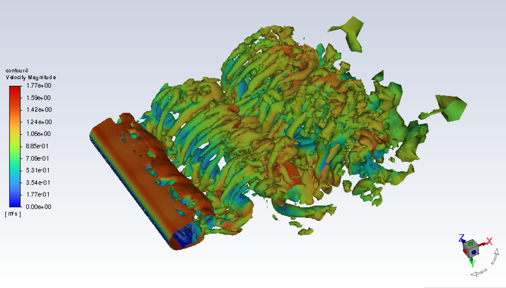

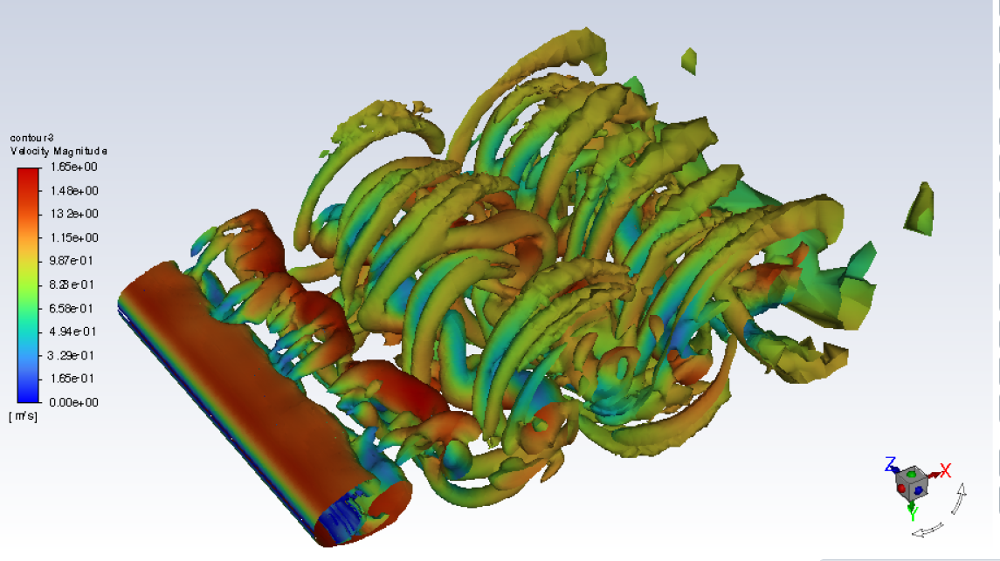
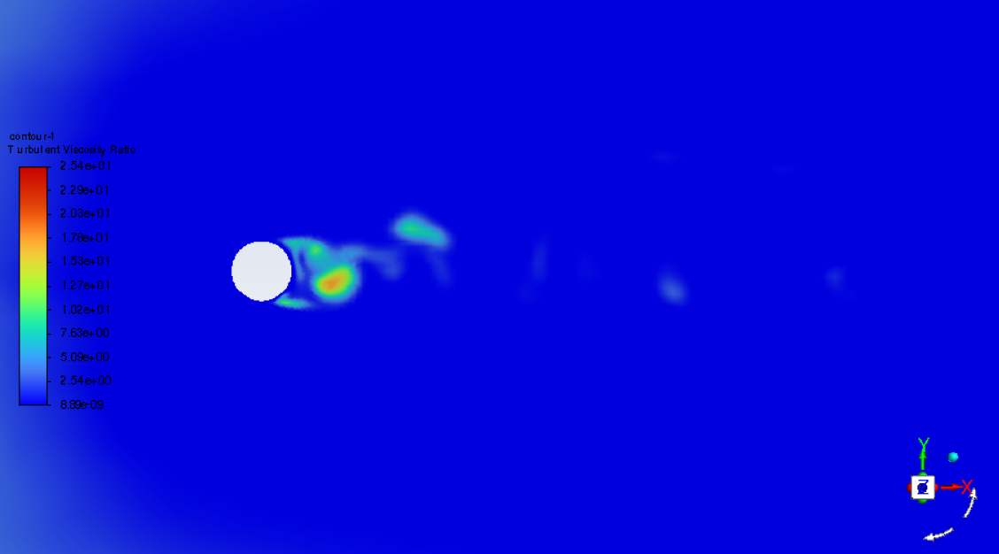

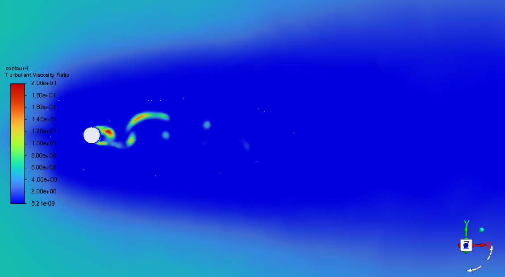

#### Partial vs. full DES length replacement

##### O2

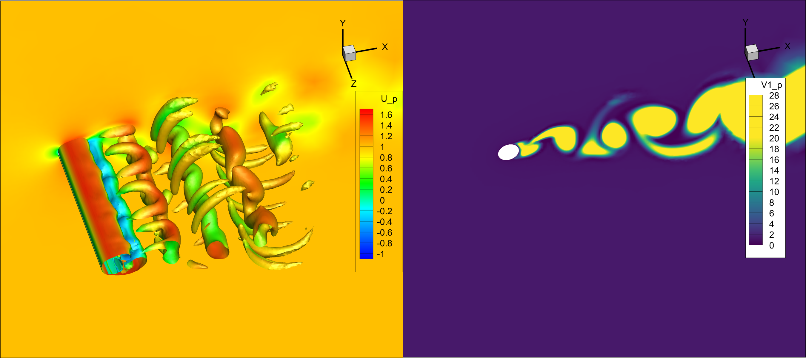

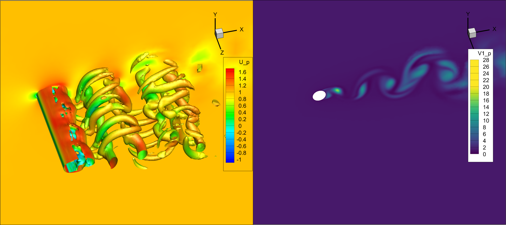

##### O4

#### Partial vs. full DES length replacement

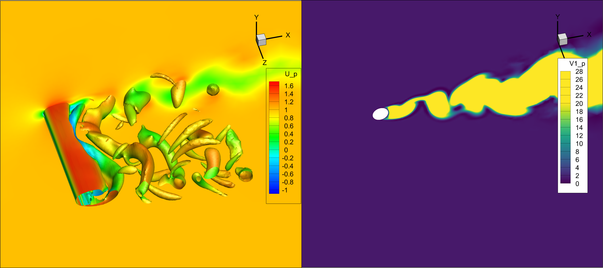

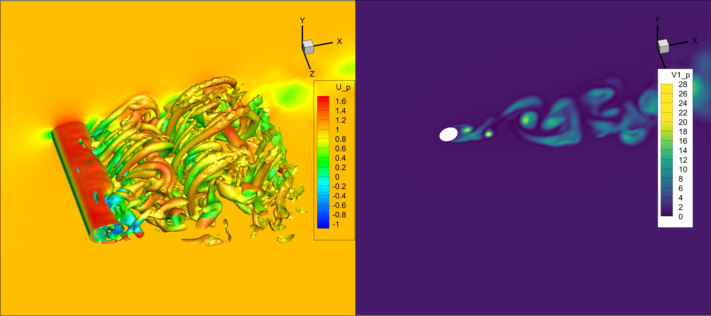

#### Full vs. modified upwind

dF02 mark: using FDS:
$$
\hat F= \frac{1}{2}(F_L+F_R)-\frac{C_{dF}}{2}R|\Lambda|L(U_R-U_L)
$$
with $C_{dF}=0.2$.

##### O2

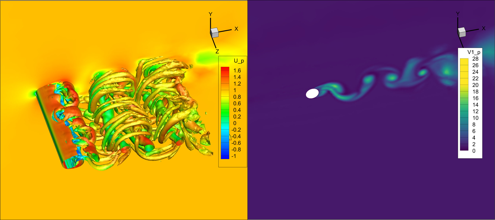

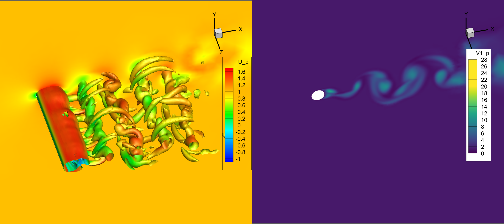

##### O4

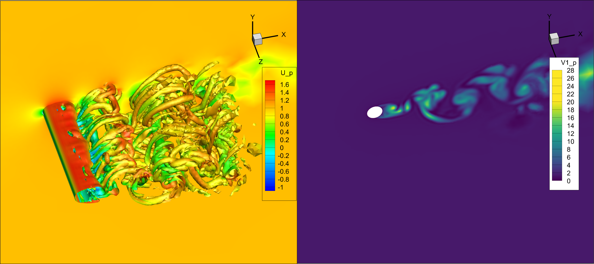

#### No $\Psi$ against $f_{t2}$

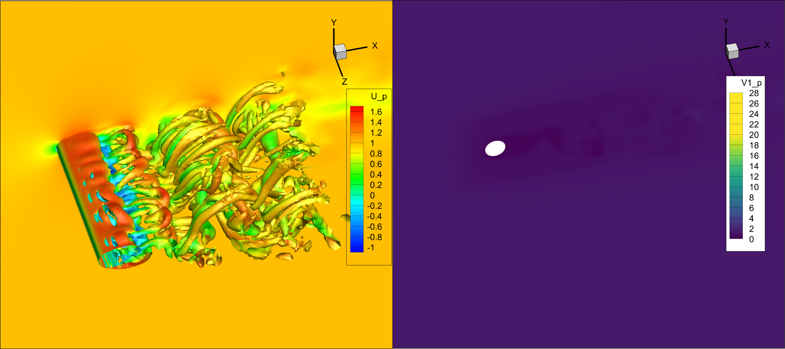

#### Others

(Wrong Rot correction)

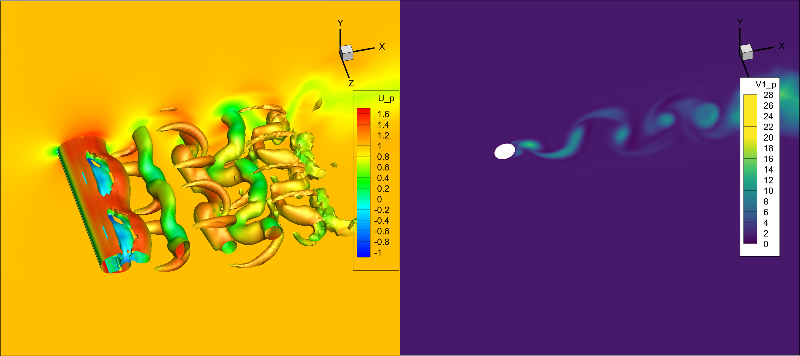

### Drag

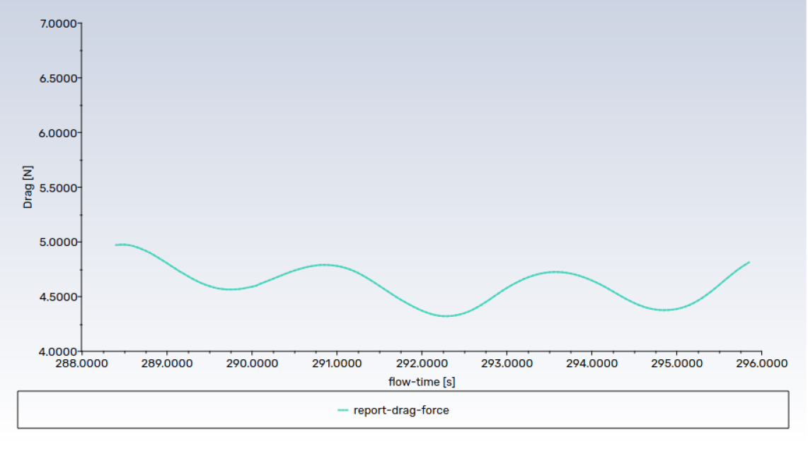

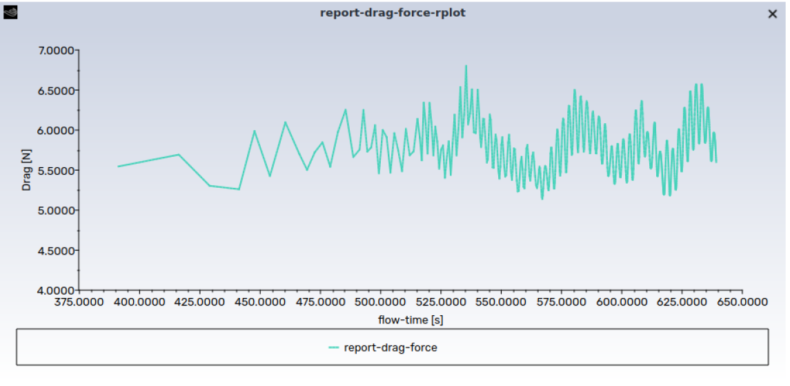

#### DNDSR drags

| Case                                                        | $C_d$      | error   | i0    |
| ----------------------------------------------------------- | ---------- | ------- | ----- |
| CylinderB1_L8U2_Rawstart2_PdT05_restart1_TH3_.log           | 1.3178e+00 | 777.6   | 18000 |
| CylinderB1_L8U2_Rawstart2_PdT05_restart2_TH3_IDDES0_.log    | 1.3309e+00 | 909.3   | 18000 |
| CylinderB1_L8U2_Rawstart2_PdT05_restart2_TH3_IDDES0_O4_.log | 1.1945e+00 | -454.6  | 18000 |
| CylinderB1_L8U2_Rawstart3_PdT05_TH3_ILES_O4_.log            | 1.0525e+00 | -1874.7 | 18000 |
| CylinderB1_L8U2_Rawstart4_PdT05_TH3_ILES_dF02R_O4_.log      | 1.0370e+00 | -2029.9 | 11607 |
| CylinderB1_L8U2_Rawstart4_PdT05_TH3_ILES_dF02R_O4_GW2_.log  | 9.8482e-01 | -2551.8 | 11942 |
| CylinderB1_L8U2_Rawstart4_PdT05_TH3_IDDES3RR1_.log          | 1.2726e+00 | 326.0   | 18000 |
| CylinderB1_L8U2_Rawstart4_PdT05_TH3_IDDES3RR1_dF02_.log     | 1.2477e+00 | 77.4    | 17586 |
| CylinderB1_L8U2_Rawstart4_PdT05_TH3_IDDES5RR2_.log          | 1.2855e+00 | 455.0   | 18000 |
| CylinderB1_L8U2_Rawstart4_PdT05_TH3_IDDES3RR2_.log          | 1.2654e+00 | 253.9   | 18000 |
| CylinderB1_L8U2_Rawstart4_PdT05_TH3_IDDES3RR2_O4_.log       | 1.2005e+00 | -395.1  | 17823 |
| CylinderB1_L8U2_Rawstart4_PdT05_TH3_IDDES3RR2_dF02_O4_.log  | 1.1362e+00 | -1038.2 | 10520 |
| CylinderB1_L8U2_Rawstart4_PdT05_TH3_IDDES3R_O4_.log         | 1.2586e+00 | 186.1   | 18000 |
| CylinderB1_L8U2_Rawstart4_PdT05_TH3_IDDES3R_dF02_.log       | 1.2136e+00 | -264.4  | 17670 |
| CylinderB1_L8U2_Rawstart4_PdT05_TH3_IDDES3R_.log            | 1.3048e+00 | 648.1   | 18000 |
| CylinderB1_L8U2_Raw4dT05_TH2_dF02_O4_GW2_.log               | 1.0958e+00 | -1441.8 | 2739  |
| CylinderB1_L8U2_Raw4dT05_TH2_dF02_O4_.log                   | 9.4938e-01 | -2906.2 | 0     |
| CylinderB1_L8U2_Raw4dT05_TH2_O4_GW2_.log                    | 1.2364e+00 | -36.1   | 18000 |
| CylinderB1_L8U2_Raw4dT05_TH3_O4_GW2_.log                    | 1.2654e+00 | 254.1   | 18000 |
| CylinderB1_L8U2_Raw4dT05_TH3_O4_.log                        | 1.2876e+00 | 476.5   | 18000 |
| CylinderB1_L8U2_Raw4dT05_TH3R_O4_GW2_.log                   | 1.2706e+00 | 306.4   | 12820 |
| CylinderB1_L8U2_Raw4dT05_TH3R_O4_.log                       | 1.2178e+00 | -222.1  | 12871 |

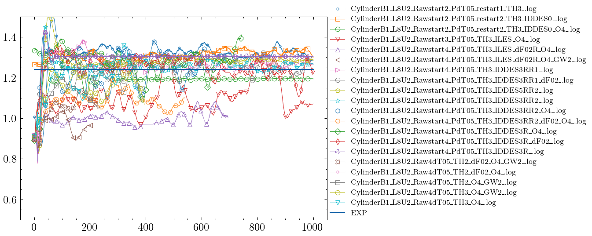

#### ILES results

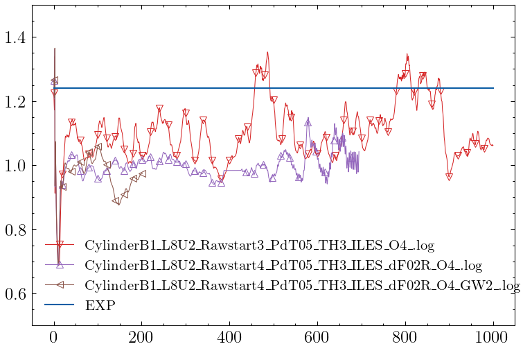

#### Different DES

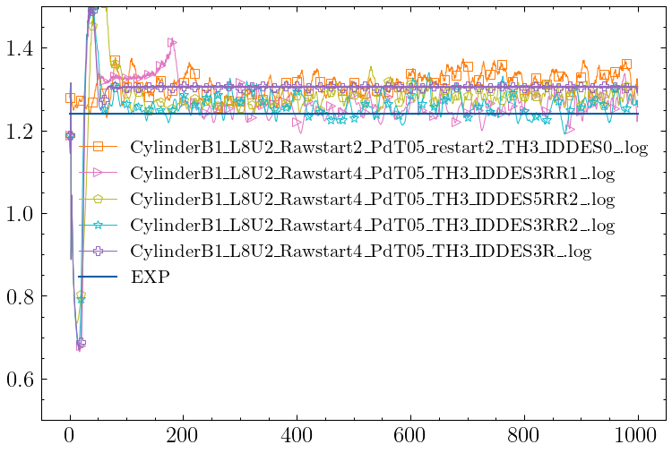

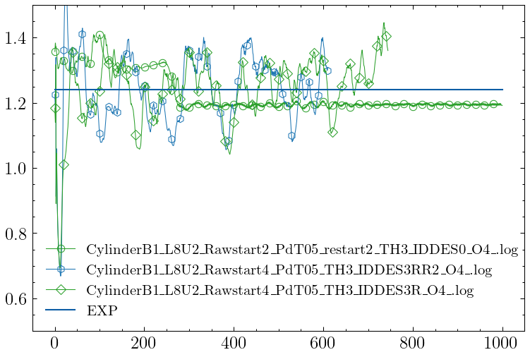

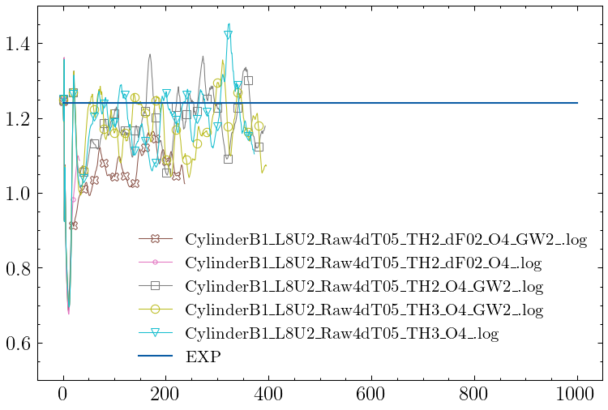
