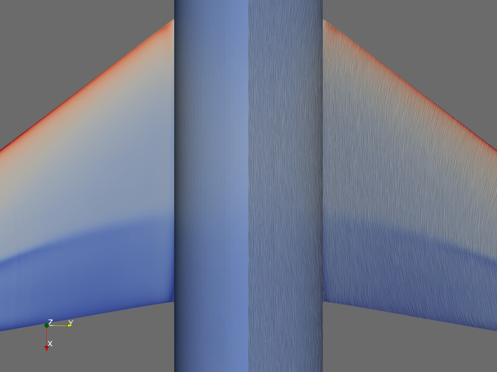
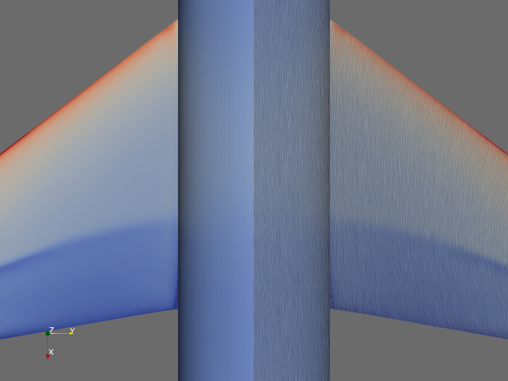
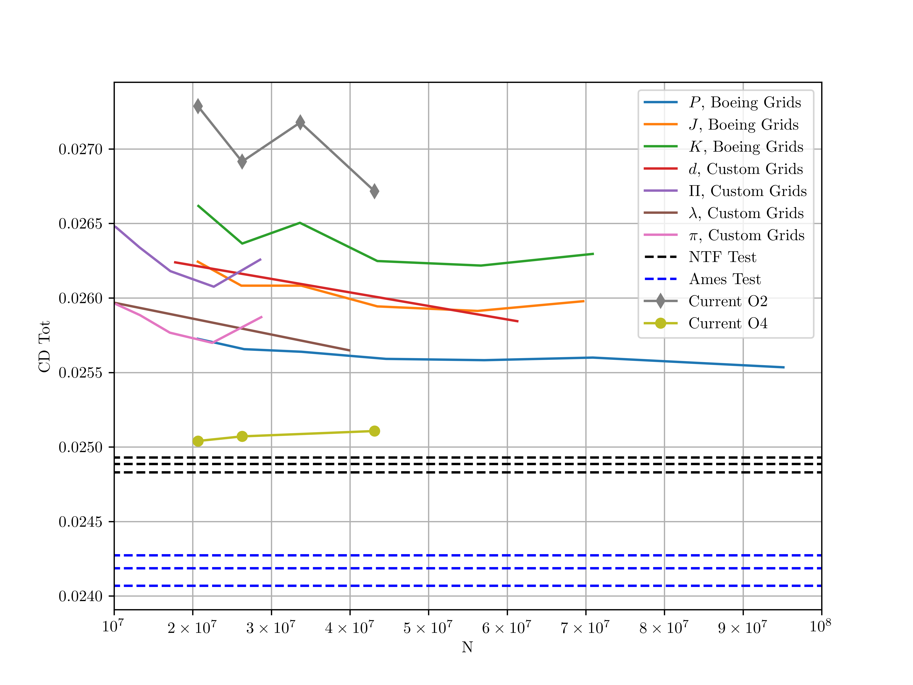
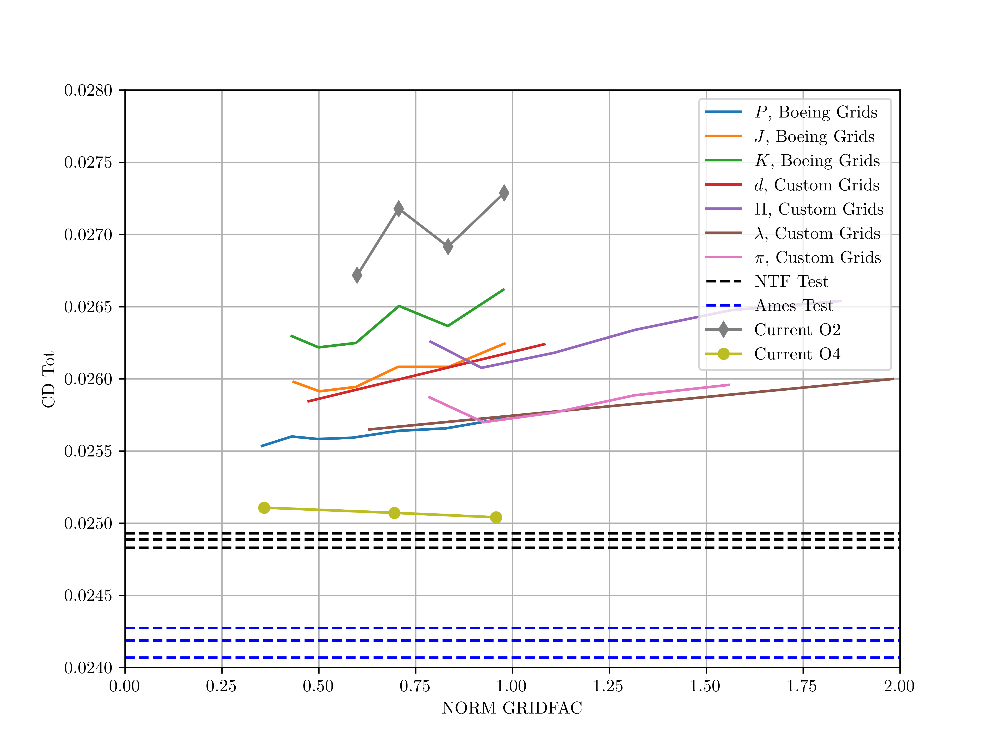

## Problem Setup

DPW6 Case2

$$
C_L=0.5\pm0.0001
$$

Mesh series: from [DPW6-Boeing](https://dpw.larc.nasa.gov/DPW6/Boeing_Babcock_Unstructured_CC.REV00/WB-AE2.75/)

WB configuraion, AE2.75

Meshes:

| Name | Size (num cell) | Note                                        |
| ---- | --------------- | ------------------------------------------- |
| WB T | 20657615        |                                             |
| WB C | 26271819        |                                             |
| WB M | 33683206        | Has 1 Pyramid distorted (negative jacobian) |
| WB F | 43126748        |                                             |

SA-rot

Use O2 (Green Gauss) / O4 (VFV HQM-OPT HQM-SD isotropic-base isotropic-functional) 

## Results

Gridfac: 

$$
\text{GRIDFAC} = \left(\frac{N}{2\times10^7}\right)^{-k/3}
$$

where $k$ is order of accuracy in discretization.

When $\text{GRIDFAC}\rightarrow0$, solution approaches continuum. Use $\text{GRIDFAC}$ + linear regression to get the intercept drag coefficient.

 

## Intercept CD

| Case Name          | CD intercept vs NTF test (counts) | CD intercept vs NTF test (relative) |
| ------------------ | --------------------------------- | ----------------------------------- |
| $P               $ | 5.67                              | \(2.3\%\)                           |
| $J               $ | 7.91                              | \(3.2\%\)                           |
| $K               $ | 10.69                             | \(4.3\%\)                           |
| $d               $ | 6.49                              | \(2.6\%\)                           |
| $\Pi             $ | 9.37                              | \(3.8\%\)                           |
| $\lambda         $ | 5.99                              | \(2.4\%\)                           |
| $\pi             $ | 7.13                              | \(2.9\%\)                           |
| $O2              $ | 12.59                             | \(5.1\%\)                           |
| $O4              $ | 2.61                              | \(1.0\%\)                           |

## Worst CD

| Case Name          | CD worst vs NTF test (counts) | CD worst vs NTF test (relative) |
| ------------------ | ----------------------------- | ------------------------------- |
| $P               $ | 8.39                          | \(3.4\%\)                       |
| $J               $ | 13.57                         | \(5.5\%\)                       |
| $K               $ | 17.30                         | \(7.0\%\)                       |
| $d               $ | 13.52                         | \(5.4\%\)                       |
| $\Pi             $ | 16.52                         | \(6.6\%\)                       |
| $\lambda         $ | 11.12                         | \(4.5\%\)                       |
| $\pi             $ | 10.71                         | \(4.3\%\)                       |
| $O2              $ | 24.00                         | \(9.6\%\)                       |
| $O4              $ | 2.20                          | \(0.9\%\)                       |

