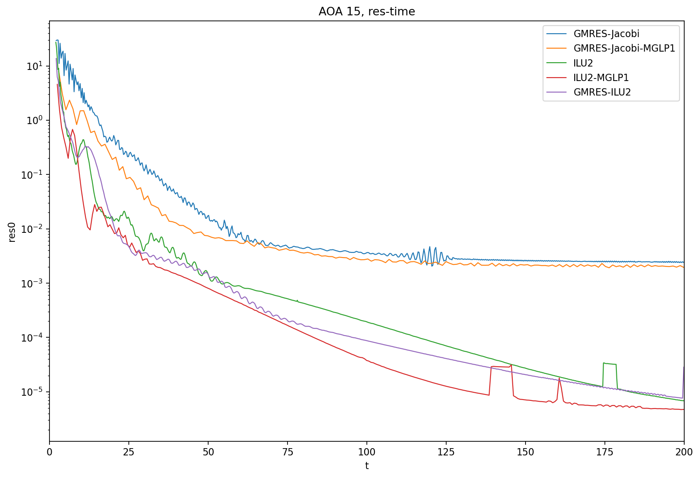
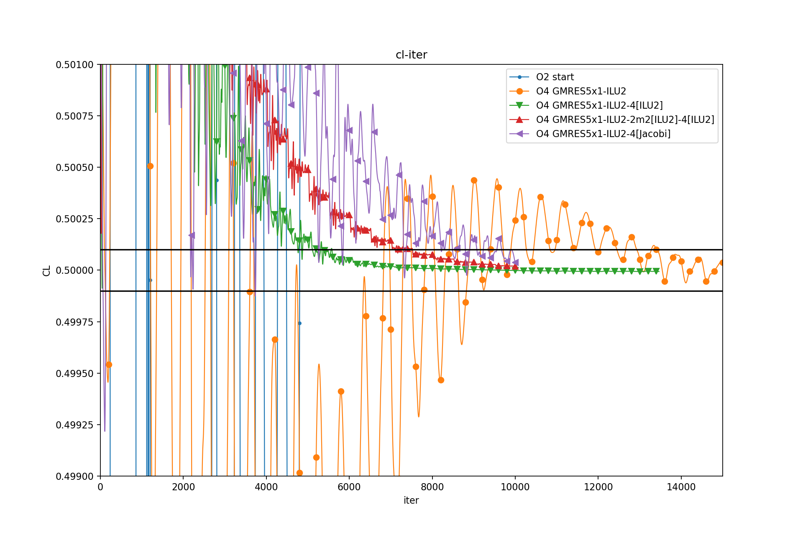

# Multigrid Test

## MG-FAS

### 非线性问题

- 非线性问题：

$$
𝐹(𝑥)=0
$$

----------------------

- 牛顿迭代：

$$
\pdv{F}{x}\Delta x = -F(x)
$$

- 近似+松弛的牛顿迭代：

$$
\left(\widehat{\pdv{F}{x}} - \tau^{-1}\right)\Delta x = -F(x)
$$

- 松弛迭代（非线性）：
  - 逐点更新$𝑥_𝑖$（可同时更新$𝐹_𝑖$，如非线性GS）
  - 牛顿迭代可以视作一种特殊的松弛
  - 牛顿迭代内部采用不同的线性求解器，也可以是松弛迭代

FAS中，计算\(∆𝑥\)更新求解本级的\(𝐹(𝑥)=0\)，即为一个松弛步/光滑步。

### FAS 通用过程

- Relax：通过密网格残差 $𝐹^ℎ (𝑥^{ℎ,𝑚})$ 计算  $𝑦^{ℎ,𝑚}=𝑥^{ℎ,𝑚}+∆𝑦^{ℎ,𝑚}$
- Restrict：$𝑦^{2ℎ,𝑚}=𝐼_ℎ^{2ℎ} 𝑦^{ℎ,𝑚}$,  $𝑟^{2ℎ}=𝐼_ℎ^{2ℎ} 𝐹^ℎ (𝑦^{ℎ,𝑚})$
- Relax： 2h网格上的待解方程：$𝐹^{2ℎ} (𝑥^{2ℎ} )=𝐹^{2ℎ} (𝑦^{2ℎ,𝑚} )−𝑟^{2ℎ}$
  - 其中初值即为$𝑥^{2ℎ,0}=𝑦^{2ℎ,𝑚}$
  - 求解后得到$𝑥^{2ℎ,𝑙𝑎𝑠𝑡}=𝑥^{2ℎ,0}+𝑒^{2ℎ, 𝑚}$
- Interpolate: $𝑒^{ℎ, 𝑚}=𝐼_{2ℎ}^ℎ 𝑒^{2ℎ, 𝑚}$, $𝑥^{ℎ,𝑚+1}=𝑦^{ℎ,𝑚}+𝑒^{ℎ, 𝑚}$

此处的$F^{2h}$为疏网格的算子。

投影/限制算子：$𝐼_ℎ^{2ℎ}$ 与 插值算子： $𝐼_{2ℎ}^ℎ$ 为线性算子。

以上$h,2h$为一相对概念，代表两级网格间的操作关系；$h,2h$仅为符号，对应的不一定是网格尺度2倍，可能是代数MG算子，或者非结构网格的几何融合，也可能是谱空间截断/多项式投影等不同解空间。

### 针对双时间步的说明：

$$
F(x)=\alpha R(x) - \frac{x}{\Delta t} + B
$$

其中 $R(x)=\dv{x}{t}, \alpha > 0$

两级网格间的操作：

- Relax：通过密网格残差 
    $$
    \widehat{𝐹}^ℎ (𝑥^{ℎ,𝑚}) = \alpha R^{h}(x^{ℎ,𝑚}) - \frac{x^{ℎ,𝑚}}{\Delta t} + B^{h}
    $$
   计算  $𝑦^{ℎ,𝑚}=𝑥^{ℎ,𝑚}+∆𝑦^{ℎ,𝑚}$
- Restrict：$𝑦^{2ℎ,𝑚}=𝐼_ℎ^{2ℎ} 𝑦^{ℎ,𝑚}$
    $$
        B^{2h}=𝐼_ℎ^{2ℎ}\alpha R^h(𝑦^{ℎ,𝑚}) + 𝐼_ℎ^{2ℎ} B^h - \alpha R^{2h}(𝑦^{2ℎ,𝑚})
    $$
- Relax： 2h网格上的待解方程：
    $$
    \widehat{𝐹}^{2ℎ} (𝑥^{2ℎ}) = \alpha R^{2h}(𝑥^{2ℎ}) - \frac{𝑥^{2ℎ}}{\Delta t} + B^{2h}
    $$
  - 其中初值即为$𝑥^{2ℎ,0}=𝑦^{2ℎ,𝑚}$
  - 求解后得到$𝑥^{2ℎ,𝑙𝑎𝑠𝑡}=𝑥^{2ℎ,0}+𝑒^{2ℎ, 𝑚}$
  - Remark: 若 $\widehat{𝐹}^ℎ (y^{ℎ,𝑚})=0$，则有$\widehat{𝐹}^{2ℎ} (y^{2ℎ,𝑚})=0$
- Interpolate: $𝑒^{ℎ, 𝑚}=𝐼_{2ℎ}^ℎ 𝑒^{2ℎ, 𝑚}$, $𝑥^{ℎ,𝑚+1}=𝑦^{ℎ,𝑚}+𝑒^{ℎ, 𝑚}$

此处的$\hat{F}^{h},\hat{F}^{2h}$为两层网格各自的残差方程，注意并非是最密网格上残差算子投影到疏网格上。

### 多级 FAS

以下描述1次最密网格解更新的过程

----------------------

示例：不做MG

- Relax on $h$

----------------------

示例：1层MG

- Relax on $h$
  - Restrict: $h\rightarrow 2h$
  - Relax on $2h$ for $n_1$ times
  - Interpolate: $2h\rightarrow h$

----------------------

示例：2层MG: V cycle

- Relax on $h$
  - Restrict: $h\rightarrow 2h$
  - Relax on $2h$ for [$n_1$ times]
    - Restrict: $2h\rightarrow 4h$
    - Relax on $4h$ for $n_2$ times
    - Interpolate: $4h\rightarrow 2h$
  - Relax on $2h$ for [$m_1$ times]
  - Interpolate: $2h\rightarrow h$

----------------------

示例：2层MG: W cycle

- Relax on $h$
  - Restrict: $h\rightarrow 2h$
  - Relax on $2h$ for [$n_1$ times]
    - Restrict: $2h\rightarrow 4h$
    - Relax on $4h$ for $n_2$ times
    - Interpolate: $4h\rightarrow 2h$
  - Relax on $2h$ for [$m_1$ times]
    - Restrict: $2h\rightarrow 4h$
    - Relax on $4h$ for $n_2$ times
    - Interpolate: $4h\rightarrow 2h$
  - Relax on $2h$ for [$k_1$ times]
  - Interpolate: $2h\rightarrow h$

----------------------

更一般来说，还存在跨越既定级别的，如$h\rightarrow 4h$的操作

## FV "Several Polys" P-Multigrid

### Definition

对于FV：

投影/限制算子：$𝐼_ℎ^{2ℎ}$ 与 插值算子： $𝐼_{2ℎ}^ℎ$ 在不同P之间都是Identity。

- P=3: finest
- P=1: 2nd order FV, Green-Gauss slope + Barth limiter
- P=0: P=1 but use cell average for flux point state (1st order accurate)

### Test 1: 1 layer

NACA0012 foil, Re 2.88E6, Ma 0.15

GMRES k=5, restart=2

Jacobi or ILU-2

np=24

MGLP1: 

- P1: ilu2 4 times

#### AOA = 5

 

#### AOA = 15

 


### Test2: 2 layers

NACA0012 foil, Re 2.88E6, Ma 0.15

np=16

MGLP1: 

- P1: ilu2 n1 times
  - P2: ilu2 n2 times

#### AOA = 5

 

#### AOA = 15

 

### Test 3: CRM CL=0.5

CRM no wing no plyon, AE @ AoA2.45

CL = 0.5, DPW6 settings


 

 

 

最终的阻力系数：

```bash
[O2 start                                ]: CD = 2.6890e-02 +- 8.8310e-04
[O4 GMRES5x1-ILU2                        ]: CD = 2.5131e-02 +- 5.6761e-07
[O4 GMRES5x1-ILU2-4[ILU2]                ]: CD = 2.5132e-02 +- 2.3278e-07
[O4 GMRES5x1-ILU2-2m2[ILU2]-4[ILU2]      ]: CD = 2.5132e-02 +- 4.0723e-07
[O4 GMRES5x1-ILU2-4[Jacobi]              ]: CD = 2.5135e-02 +- 9.2533e-06
```

### 算例 Brief

- 相对于无MG收敛加速：有时明显，有时比较微弱
- P=0的加入效果不明显，很难保证加速
- CRM：
  - 加入MG对CL收敛没有加速
    - 这应该和CL Driver有关
  - 残差收敛似乎加速明显
    - 需要针对此进行测试
  
