**Evidence curated 29 September 2026.** This post brings together the corrected
H2/O2 benchmarks and the n-heptane ignition-plus-front experiment. The numerical
cutoff includes the completed Balance test at code step \(4\times10^{-4}\).
The \(8\times10^{-4}\) comparison has reserved slots below; its numerical results
are not included in this edition. No new CFD was launched during curation.

## Conclusions and evidence coverage

1. **broadA remains the established flame-preserving recipe.** BA-CE6 reproduces
   its ESDIRK2 flame-speed behavior while allowing chemically difficult, weakly
   diffusive ignition states to select Strang. However, the archived flame
   matrices are fixed-inner-work calculations, not converged implicit solutions.
2. **Detonation does not have a universal preferred endpoint.** On the same
   fine grid, ESDIRK2 at \(8\times10^{-7}\) favors Strang, while U2R2 at that step
   favors coupled. No BA-CE6 detonation a-posteriori matrix exists in the archive;
   similarity of its frozen selector to broadA is not a substitute for one.
3. **The two-scale case exposes different regional errors.** At matched
   \(4\times10^{-4}\), coupled better preserves the interface's worst temperature
   error than Strang, but has much larger ignition-kernel error. Balance retains
   localized interface mixing and improves kernel errors substantially relative
   to coupled. It does not win every metric, and its small mean-error advantage
   over Strang is below the available reference-refinement sensitivity.
4. **BA-CE6 is too eager to escape in this particular prepared case.** It selects
   Strang everywhere in all 55 evaluated snapshot/timestep combinations. Balance
   is a rate-balance alternative, not a validated universal replacement.

| Evidence | broadA | BA-CE6 | Balance |
|---|---|---|---|
| Corrected H2/O2 flame, 3 ODE × 3 steps, with endpoint controls | Complete terminal accounting | Same campaign: 31 completed, 5 failed across all 36 rows | Unrun |
| Fine H2/O2 detonation, 3 ODE × 4 steps, plus coarse ESDIRK2 | Complete: 52 rows including endpoints/default | **Unrun; a-priori only** | Unrun |
| Earlier hot n-heptane, ESDIRK2 × 5 steps × 4 treatments | Complete | Complete | Unrun |
| Prepared ignition + front, same-checkpoint short window | Completed at \(2\times10^{-4}\) and \(4\times10^{-4}\) | A-priori only; not a separate CFD row | Completed at \(4\times10^{-4}\) |
| Prepared ignition + front, \(8\times10^{-4}\) | Pending integration | Not scheduled | Pending integration |

“Complete accounting” includes failures; it does not mean every row yields a
valid accuracy result. The detailed [two-scale report](https://github.com/harryzhou2000/reaction-region-indicator/blob/main/studies/nheptane_two_scale_strang/REPORT.md)
contains all comparison plots, tables, startup records and frozen-state figures.
The linked study records require access to the research repository; the figures
needed to read this post are included on this page.

## Common mixed-integration contract

Let \(U\) be the cell-mean conservative state, \(F(U)\) the spatial flow residual
(convection and diffusion, with nonchemical sources if present), and \(S(U)\)
the local chemical source. For a field \(\chi_i\in[0,1]\) frozen at the beginning
of each physical step, partition the evolution as

$$
\frac{\mathrm dU}{\mathrm dt}=F(U)+S(U),\qquad
G_\chi(U)=F(U)+(1-\chi)S(U),\qquad Q_\chi(U)=\chi S(U).
$$

Advance \(Q_\chi\) for half a step, \(G_\chi\) for a full step, and \(Q_\chi\) for
half a step. The cell-local chemistry advance is constant-volume; the flow
advance uses the selected ODE method. Thus **\(\chi=0\) is fully coupled** and
**\(\chi=1\) is full Strang**. Values strictly between them split only part of
the chemistry. This is not a convex combination of two completed solutions.
The separate debugging source multiplier multiplies chemistry independently;
it is unity in these studies. Nonchemical sources are not multiplied by \(\chi\).

All three retained recipes use the same snapping operator and zero spatial passes:

$$
\mathcal P(z)=
\begin{cases}
0,&z\le0.01,\\
z,&0.01\lt z\lt0.95,\\
1,&z\ge0.95.
\end{cases}
$$

Exact zero skips that cell's split chemistry advance; exact one removes its
chemistry work from the implicit flow RHS. The upper threshold here is the
**retained recipe's 0.05 distance from one**, not the general solver default.
Post-step diagnostic output contains the **last pre-step frozen selector**,
not necessarily a selector reevaluated on the plotted final state.

The common threshold-and-power function is

$$
H(z;z_0,p)=\frac{(z/z_0)^p}{1+(z/z_0)^p},\qquad z\ge0,\quad z_0>0,\quad p>0.
$$

\(z_0\) is the half-activation value and \(p\) controls transition sharpness.
All arguments and thresholds below are dimensionless. The physical step is
\(\Delta t=\Delta t_{\rm code}L_0/U_0\); for the two-scale case,
\(L_0=1\,\mathrm m\), \(U_0=379\,\mathrm{m\,s^{-1}}\).

### Constituent fields used by broadA and BA-CE6

For species \(k\), let \(Y_k\) be mass fraction, \(W_k\) molecular weight,
\(\dot\omega_k\) net molar production per volume per time, and
\(\dot m_k=W_k\dot\omega_k\) net mass production per volume per time.
\(\rho\) is mass density; \(T\) is absolute temperature; \(c_v\) is mixture
mass-specific constant-volume heat capacity; \(h_k\) is species mass-specific
enthalpy including formation enthalpy. Define

$$
\dot q_h=-\sum_k h_k\dot m_k,\qquad
T_{\rm scale}=\max(T,T_{\rm floor}),\qquad
A=\left[\sum_k\left(\frac{\dot m_k}{\rho}\right)^2+
\left(\frac{\dot q_h}{\rho c_vT_{\rm scale}}\right)^2\right]^{1/2}.
$$

\(\dot q_h\) is an enthalpy-based volumetric heat-release proxy in
\(\mathrm{W\,m^{-3}}\), not an exact constant-volume temperature derivative.
\(T_{\rm scale}\) is a temperature in kelvin; the ratio in \(A\) has units
\(\mathrm{s^{-1}}\). \(T_{\rm floor}\) is the mechanism's supported lower
temperature bound. There is no logarithm of a dimensional temperature.

For face-neighbor cells \(i,j\), let \(\ell_{ij}\) be physical center distance,
\(\ell_i\) the physical maximum cell-length scale, and \(Y_*=10^{-3}\). The
solver-form gradient estimate is

$$
G_i=\max_{j\in\mathcal N(i)}\left[
\left(\frac{T_j-T_i}{\ell_{ij}\max(T_i,T_j,T_{\rm floor})}\right)^2+
\sum_{k:\,\max(Y_{k,i},Y_{k,j})\ge Y_*}
\left(\frac{Y_{k,j}-Y_{k,i}}{\ell_{ij}\max(Y_{k,i},Y_{k,j},Y_*)}\right)^2
\right]^{1/2}.
$$

$$
L_{{\rm grad},i}=\max(G_i^{-1},\ell_i),\qquad
B_i=\frac{D_{\max,i}}{L_{{\rm grad},i}^{2}},\qquad
a_i=\Delta t A_i,\quad b_i=\Delta t B_i.
$$

Use \(B_i=0\) when \(G_i=0\). \(D_{\max}\) is the largest mixture-averaged species
diffusivity in \(\mathrm{m^2\,s^{-1}}\). \(B\) is an inverse-time diffusion-scale
estimate, **not an evaluated diffusive RHS**. Physical-boundary faces without
a neighbor do not add a jump. The temperature term approximates the gradient
of \(\ln(T/T_{\rm ref})\) for any fixed positive reference temperature; the
finite difference is not exactly a logarithmic difference. The cell-length
bound limits activation by gradients below the represented spatial scale.

The pressure sensor and shock suppression are

$$
h_i=\max_{j\in\mathcal N(i)}
\frac{|p_j-p_i|}{\max(|p_i|,|p_j|,p_\epsilon)},\qquad
g_{h,i}=\frac{1}{1+(h_i/0.08)^4}.
$$

Here \(p\) is pressure and \(p_\epsilon\) is only a positive numerical safeguard,
negligible in these positive-pressure cases. The symbol \(h_i\) denotes a
pressure jump, distinct from species enthalpy \(h_k\). Strong jumps reduce
coupling; this is an empirical shock preference, not a theorem that Strang
is always more accurate in detonations.

### broadA: broad activity activation

$$
C_A=H(a;10,1/2)H(b;2,1/2)g_h,\qquad
f_A=H(C_A;0.005,3),\qquad \chi_A=\mathcal P(1-f_A).
$$

\(f_A\) is the raw coupled fraction. The square-root Hill factors activate
gradually, and the low outer midpoint broadens the coupled band relative to
the earlier default. No expansion/filter passes are used. \(A\) and \(B\) must
both be nonzero. At fixed positive rates, \(\Delta t\to0\) gives Strang;
\(\Delta t\to\infty\) gives raw coupled fraction \(H(g_h;0.005,3)\).
Hence a smooth, weakly diffusive but very stiff ignition region can eventually
become strongly coupled even when that is not advantageous.

### BA-CE6: broadA with chemistry escape

Define the concentration-Jacobian proxy

$$
\Lambda=\max_k\left|\frac{\partial\dot\omega_k}{\partial C_k}\right|,
\qquad s=\Delta t\Lambda,\qquad r=\frac{B}{\Lambda},
$$

where \(C_k\) is species molar concentration. The diagonal derivatives use
Cantera's `net_production_rates_ddCi`: temperature, pressure and all other
species concentrations are held fixed under that API's derivative convention.
[Cantera kinetics reference](https://www.cantera.org/stable/python/kinetics.html#cantera.Kinetics.net_production_rates_ddCi).
This is
not the spectral radius of the full constant-energy reactor Jacobian, nor a
measured nonlinear convergence rate. \(\Lambda\) has units \(\mathrm{s^{-1}}\).
For \(\Lambda>0\), set

$$
E=H(s;100,2)\,[1-H(r;10^{-6},6)],\qquad
\chi_{\rm CE6}=\mathcal P\bigl(1-f_A(1-E)\bigr).
$$

Set \(E=0\) when \(\Lambda=0\). The gate releases chemistry toward Strang when
the timestep is long relative to the fast chemical scale and diffusion is
weak relative to that scale. It can only **remove** broadA coupling. “6” is
the power on the \(B/\Lambda\) gate, not an ODE order. At positive fixed rates,

$$
f_{{\rm CE6},\infty}=H(g_h;0.005,3)H(B/\Lambda;10^{-6},6).
$$

This preserves the tested H2/O2 flame band but can erase a real interface if
a very fast chemical mode drives \(B/\Lambda\) below the threshold. The numerical
value \(10^{-6}\) is calibrated, not a universal physical boundary. This recipe
is the refined mode-2 BA-CE6, not the earlier unsuccessful ratio-only v2.

### Balance: compare actual chemical and diffusive rate coordinates

Use all species and temperature in the same coordinates:

$$
\mathcal A=\left[\sum_k\dot Y_{S,k}^{2}+(\dot T_S/T)^2\right]^{1/2},
\qquad
\mathcal D=\left[\sum_k\dot Y_{D,k}^{2}+(\dot T_D/T)^2\right]^{1/2}.
$$

Both norms have units \(\mathrm{s^{-1}}\). They contain no division by trace
species fractions. With species mass-specific internal energy \(e_k(T)\),
including formation energy,

$$
\dot Y_{S,k}=\dot m_k/\rho,\qquad
\rho c_v\dot T_S=-\sum_k e_k\dot m_k.
$$

Unlike broadA's \(\dot q_h\) proxy, this chemical temperature rate is consistent
with fixed volume and total energy. For molecular diffusion, form

$$
\mathbf j_k^{0}=-\rho D_k\nabla Y_k,\qquad
\mathbf j_k=\mathbf j_k^{0}-Y_k\sum_l\mathbf j_l^{0},\qquad
\mathbf q=-\kappa\nabla T+\sum_k h_k\mathbf j_k,
$$

$$
S_{D,k}=-\nabla\cdot\mathbf j_k,\qquad
\dot Y_{D,k}=S_{D,k}/\rho,\qquad
\rho c_v\dot T_D=-\nabla\cdot\mathbf q-\sum_k e_kS_{D,k}.
$$

\(\kappa\) is thermal conductivity; \(\mathbf j_k\) is a mass flux with zero summed
species flux; \(\mathbf q\) includes conduction and diffusing species enthalpy.
The last subtraction removes composition-induced internal-energy change
before converting the energy rate to a temperature rate. In the diagnostic,
centered two-point cell-mean gradients and averaged face coefficients estimate
these divergences. Physical-boundary diffusive flux is zero. This estimator
does **not** replace the solver's reconstructed spatial residual and does not
include convection, compression or viscous heating.

$$
\alpha=\Delta t\mathcal A,\qquad d=\Delta t\mathcal D,\qquad
Z=\frac{\alpha d}{(1+\alpha)^2},\qquad
\chi_{\rm Balance}=\mathcal P\left(\frac{1}{1+(g_hZ/\theta)^p}\right),
\qquad \theta=0.001,\quad p=2.
$$

\(\alpha\) is deliberately distinguished from broadA's \(a\): its temperature
component uses internal energy rather than enthalpy. The midpoint and power
were selected from an a-priori screen before this candidate's CFD result:
\(\theta\in\{0.0005,0.001,0.002,0.005,0.01,0.02\}\), \(p\in\{2,3\}\).
There is no Jacobian, chemistry-escape ratio or additional activity gate.
The shared shock gate and endpoint thresholds remain parameters.

For fixed nonzero \(\mathcal A\),

$$
Z\sim\Delta t^2\mathcal A\mathcal D\quad(\Delta t\to0),\qquad
Z\longrightarrow\mathcal D/\mathcal A\quad(\Delta t\to\infty).
$$

Zero chemistry or diffusion selects Strang. Large-step coupling therefore
requires an appreciable *current diffusive rate relative to chemical rate*,
not merely a large gradient multiplied by an arbitrarily large timestep.
Net-rate cancellation, stiff near-equilibrium chemistry, omitted convection,
mesh dependence and physical boundary modeling remain blind spots. The
implementation has only been validated on this orthogonal, closed strip.

## H2/O2 flame: complete latest four-treatment matrix

This is the [BA-CE6 campaign](https://github.com/harryzhou2000/reaction-region-indicator/blob/main/studies/aposteriori_bace6_matrices/REPORT.md), with
its own rerun broadA and endpoint controls, rather than selectively combining
rows from different campaigns. It uses the corrected multispecies temperature
gradient, a Cantera stationary initial profile, fresh `BCIn` and burned `BCFar`,
\(25\,\mu\mathrm m\) spacing, P1 FV, and final code time 0.5. The reference is
\(S_{L,\rm ref}=2.2539659772\,\mathrm{m\,s^{-1}}\). Burning velocity is recovered
from fresh-gas velocity minus fitted laboratory-frame front speed:

$$
S_L=u_{\rm fresh}-\frac{\mathrm dx_f}{\mathrm dt},\qquad
\varepsilon_S=100\left(\frac{S_L}{S_{L,\rm ref}}-1\right)\%.
$$

Fits use code times 0.2–0.5. ODE codes are 204 (ESDIRK2), 412 (U2R1) and 411
(U2R2). All 36 requested rows have terminal accounting: 31 completed and five
Strang failures. **All 11,212 physical steps of the completed rows hit the
100-iteration cap**; 15,255 observed implicit-stage groups are capped.
These are fixed-work observations. An asterisk below marks \(R^2<0.9\), where
the fitted speed is only an interval average, not a reliable steady speed.

| ODE | Code dt | Coupled | Strang | broadA | BA-CE6 |
|---|---:|---:|---:|---:|---:|
| ESDIRK2 | 0.00075 | -1.223% | +1.259% | -1.186% | -1.186% |
| ESDIRK2 | 0.002 | -1.001% | +13.931% | -1.112%* | -1.112%* |
| ESDIRK2 | 0.004 | -1.235% | failed | -1.119% | -1.119% |
| U2R1 | 0.00075 | -1.050% | -0.979% | -1.218% | -1.218% |
| U2R1 | 0.002 | +2.680%* | +3.466% | +2.107% | +2.107% |
| U2R1 | 0.004 | +38.652%* | failed | +16.707%* | +7.681%* |
| U2R2 | 0.00075 | -1.025% | failed | -1.075% | -1.075% |
| U2R2 | 0.002 | -1.268% | failed | -1.391%* | -1.572%* |
| U2R2 | 0.004 | -1.911% | failed | -1.831%* | -1.885%* |

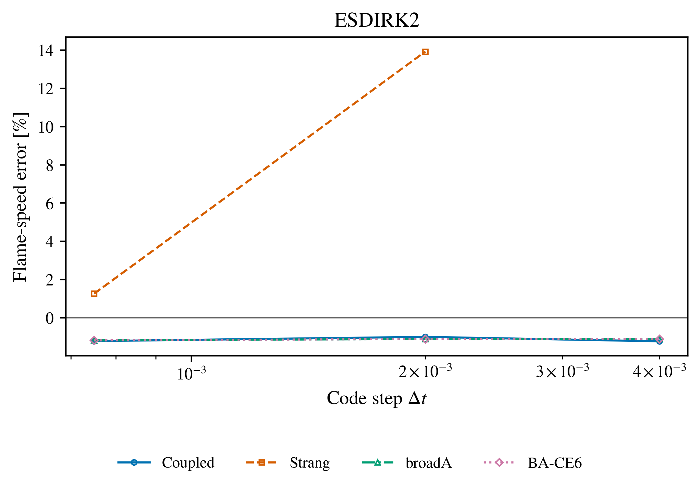

**ESDIRK2 flame errors.** broadA and BA-CE6 retain roughly −1.1% fitted error;
Strang reaches +13.9% at the middle step and fails at the largest. All completed
curves are inner-capped, including those close to the reference speed.

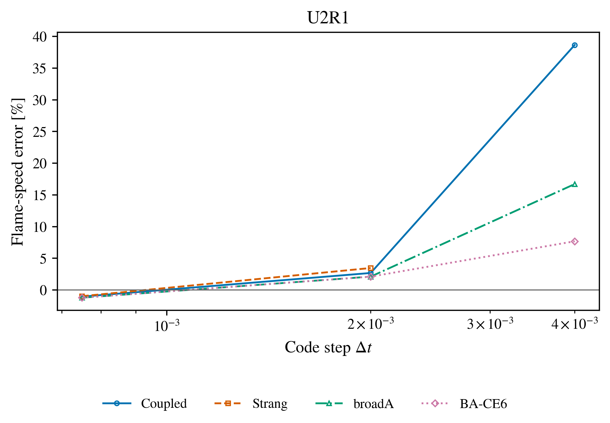

**U2R1 flame errors.** The coarse-step BA-CE6 interval fit is closer to the
reference than broadA or coupled, but all those coarse trajectories have low
\(R^2\); the smaller apparent percentage is not proof of a steady accurate flame.

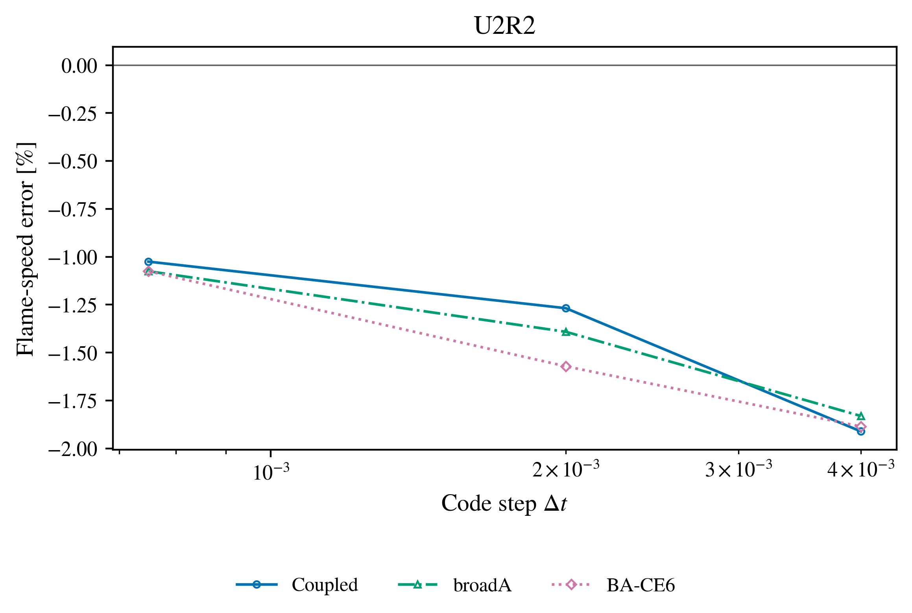

**U2R2 flame errors.** Adaptive rows finish where Strang fails. Small signed
errors in the medium/coarse adaptive rows coexist with low front-fit linearity.

### Do not interchange the older broadA campaign

The earlier [full matrix](https://github.com/harryzhou2000/reaction-region-indicator/blob/main/studies/h2o2_1d_full_matrix/REPORT.md) compared
coupled/Strang/default/broadA. Its broadA coarse U2R1 error is **+3.717%**,
whereas the later BA-CE6 campaign's rerun broadA gives **+16.707%**. Their
\(R^2\) values are only 0.175 and 0.230. The later BA-CE6 value is **+7.681%**
with \(R^2=0.248\). All are fixed-work, nonstationary fits. This report uses the
later four-treatment campaign consistently and does not replace its broadA
control with the more attractive older number. The difference has not been
isolated into a unique cause.

## H2/O2 detonation: fine-grid posterior matrix

The laboratory-frame fitted ZND setup uses **5000 cells over 12.5 mm**,
\(\Delta x=2.5\,\mu\mathrm m\), initial shock at 2.5 mm and left `BCFar` matching
the downstream state. The fitted induction length is about \(50.04\,\mu\mathrm m\)
(about 20 cells). The same-grid reference is the observed-order time-limit
extrapolation of the coupled ESDIRK4 study,

$$
D_0=2798.224963262598\,\mathrm{m\,s^{-1}},\qquad
\varepsilon_D=100\left(\frac{D}{D_0}-1\right)\%.
$$

This is **not** the equilibrium Cantera/SDToolbox CJ value
\(2836.381883789159\,\mathrm{m\,s^{-1}}\) and is not a spatially converged
continuum reference. Spatial convergence remains deferred. All 52 archived
rows have fitted speeds; front fits use \(4.0\le x_f\le8.25\) mm and have
\(R^2\ge0.999978\). The `default` column is the earlier default-Hill control,
not BA-CE6 or Balance. Every BA-CE6 entry is explicitly unrun.

| ODE | Code dt | Coupled | Strang | default | broadA | BA-CE6 |
|---|---:|---:|---:|---:|---:|---|
| ESDIRK2 | 1e-07 | +0.030% | +0.027% | +0.027% | +0.027% | unrun |
| ESDIRK2 | 2e-07 | +0.135% | +0.073% | +0.073% | +0.076% | unrun |
| ESDIRK2 | 4e-07 | +0.456% | +0.242% | +0.242% | +0.244% | unrun |
| ESDIRK2 | 8e-07 | +1.295% | +0.311% | +0.420% | +0.589% | unrun |
| ESDIRK2 | 1.6e-06 | +16.627% | +19.380% | +19.915% | +20.039% | unrun |
| U2R1 | 1e-07 | +0.031% | +0.031% | +0.031% | +0.031% | unrun |
| U2R1 | 2e-07 | +0.134% | +0.125% | +0.125% | +0.118% | unrun |
| U2R1 | 4e-07 | +0.319% | +0.313% | +0.309% | +0.296% | unrun |
| U2R1 | 8e-07 | +0.745% | +0.693% | +0.712% | +0.735% | unrun |
| U2R2 | 1e-07 | -0.376% | -0.371% | -0.371% | -0.371% | unrun |
| U2R2 | 2e-07 | -0.183% | -0.313% | -0.313% | -0.316% | unrun |
| U2R2 | 4e-07 | -0.049% | -0.092% | -0.092% | -0.104% | unrun |
| U2R2 | 8e-07 | +0.360% | +0.943% | +1.026% | +1.017% | unrun |

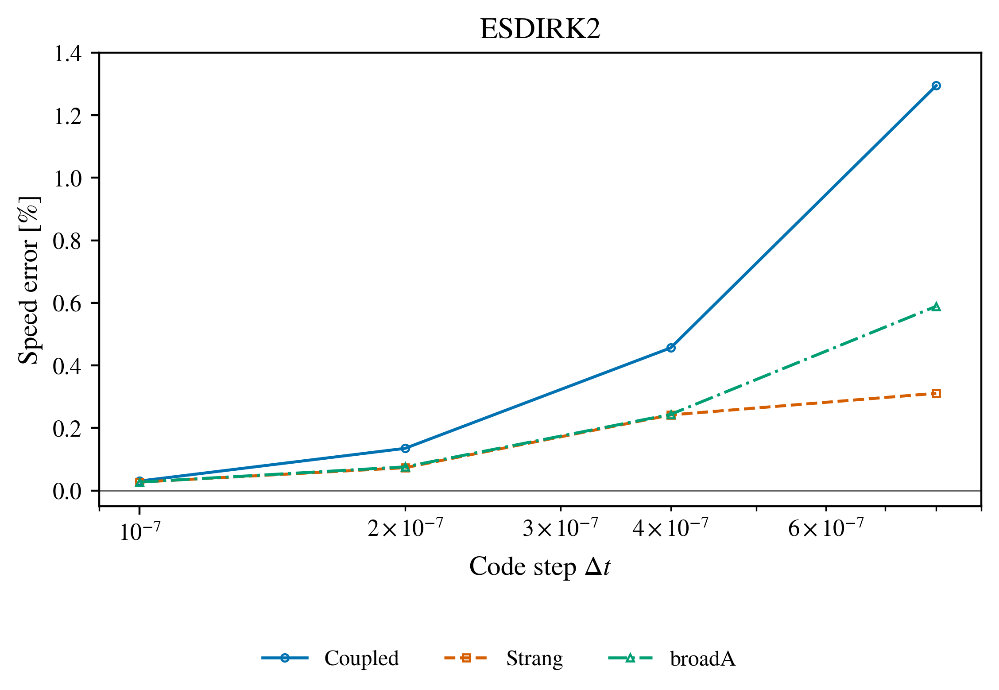

**ESDIRK2 through \(8\times10^{-7}\).** This zoom resolves the favorable Strang
and broadA errors at useful timesteps without compressing them against the
coarse-step breakdown. The complete larger-step view follows.

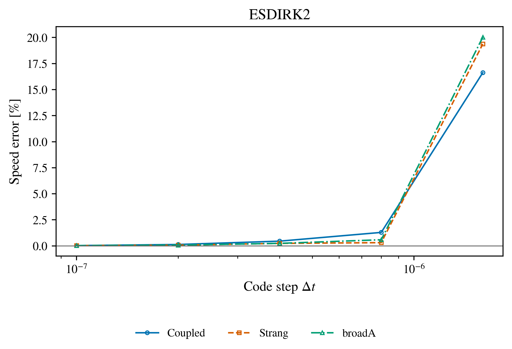

**ESDIRK2 detonation errors.** At \(8\times10^{-7}\), Strang and broadA improve
on coupled. The \(1.6\times10^{-6}\) extension makes every treatment poor and
dominates the vertical scale; use the table to resolve the smaller-step errors.

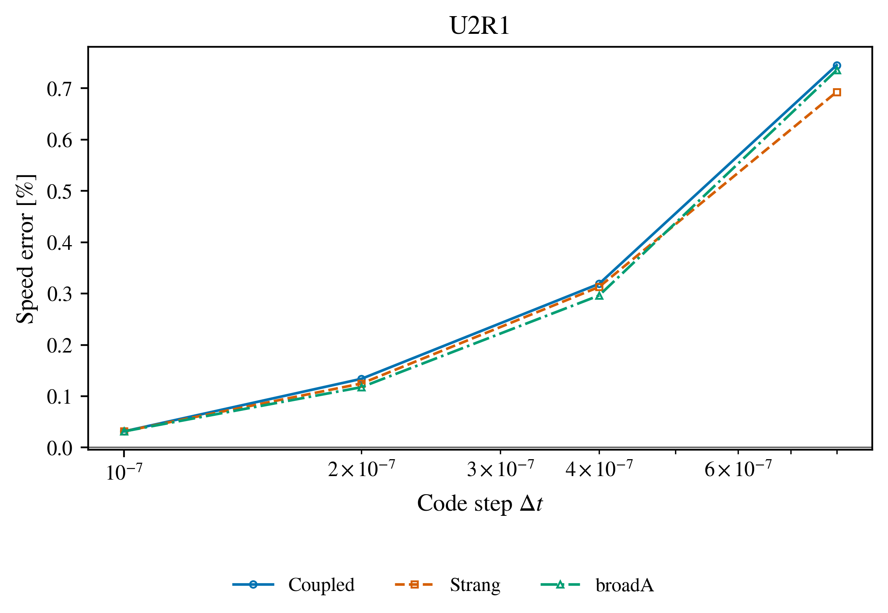

**U2R1 detonation errors.** Differences among treatments are much smaller than
the timestep trend, so no large mixed-method accuracy advantage follows.

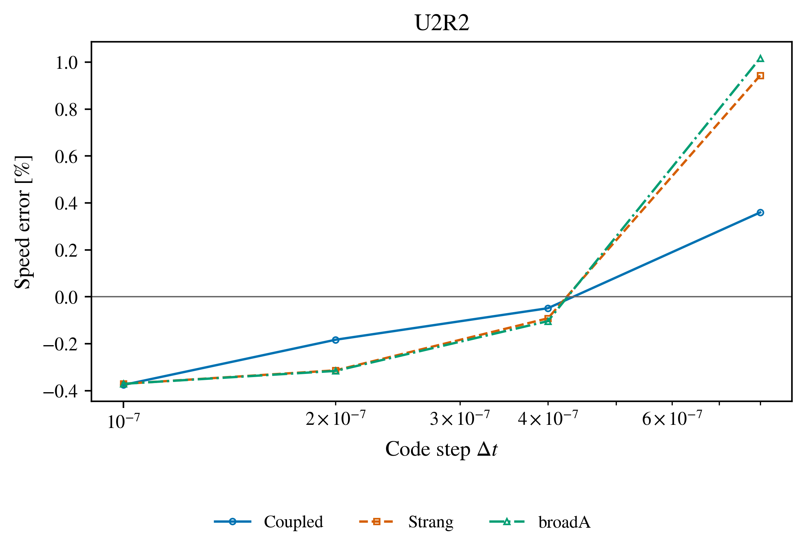

**U2R2 detonation errors.** At \(8\times10^{-7}\) the endpoint ordering reverses:
coupled has +0.360% error versus +0.943% for Strang and +1.017% for broadA.
A shock preference alone cannot guarantee the better temporal method.

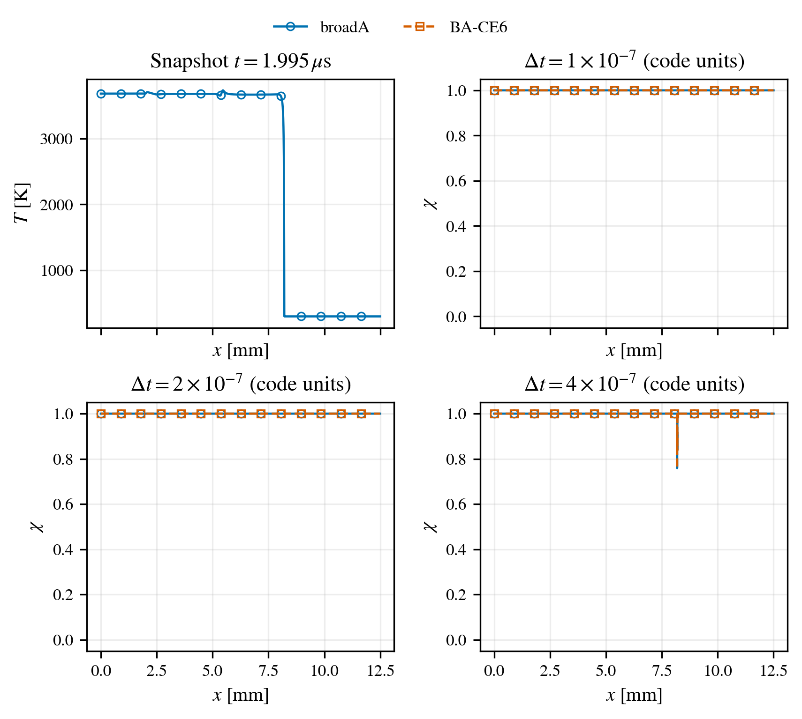

**The available BA-CE6 detonation evidence is static.** At the three annotated
prospective steps, its selector overlaps broadA on this saved profile. This
does not establish BA-CE6 speed, nonlinear convergence or runtime. Also note
the convention: near-Strang means \(\chi\) near **one**, not zero.

## Why n-heptane and what NTC means

The mechanism has the Seiser/Pitsch/Curran reduced LLNL lineage. LLNL's short
mechanism descends from its older version-38 detailed mechanism, with 159
species and 770 reversible reactions; it is not the latest detailed LLNL
mechanism. [LLNL mechanism description](https://combustion.llnl.gov/archived-mechanisms/alkanes/heptane-reduced-mechanism).
The actual DNDSR YAML used here contains **160 species and 1540 directed
reactions**, as counted in the saved Cantera manifest. It has the existing
low-temperature thermodynamic extension, with constant endpoint heat capacities
below the original interval, to support the solver's 1 K bound. This numerical
extension is not validation of reaction kinetics at cryogenic temperatures.
All reductions use the exact species order; the absorbed last species in this
case is `c5h9o1-4`, not nitrogen.

### Chemicals represented

**n-Heptane** is the straight-chain saturated hydrocarbon
\(\mathrm{CH_3(CH_2)_5CH_3}\), with molecular formula \(\mathrm{C_7H_{16}}\);
its mechanism identifier is `nc7h16`. In this case it is gaseous fuel, not a
liquid spray. The fresh oxidizer is oxygen diluted by nitrogen. The initial
molar ratio is **n-heptane : oxygen : nitrogen = 1 : 11 : 41.36**,
corresponding to the stoichiometric mixture. The overall complete-oxidation
balance, not an elementary reaction in the kinetic mechanism, is

$$
\mathrm{C_7H_{16}}+11\,\mathrm{O_2}
\longrightarrow 7\,\mathrm{CO_2}+8\,\mathrm{H_2O}.
$$

The model does not jump directly from fuel to final products: it evolves
small radicals, fragments and oxygenated intermediates through many reactions.
The following groups explain the fields plotted in this study and the
low-temperature pathways relevant to ignition:

| Group | Representative exact identifiers | Meaning in this study |
|---|---|---|
| Fuel and oxidizer | `nc7h16`, `o2` | Gaseous n-heptane and molecular oxygen. |
| Bath gas | `n2` | Nitrogen diluent; contributes to mixture thermodynamics/transport and collision-partner effects, but is the only nitrogen-bearing species. |
| Major products and smaller molecules | `co2`, `h2o`, `co`, `h2`, `ch4` | Carbon dioxide and water are principal complete-oxidation products; CO, hydrogen and methane also participate in the finite-rate network. |
| Small radical pool | `h`, `o`, `oh`, `ch3`, `hco` | Hydrogen, oxygen, hydroxyl, methyl and formyl radicals carry the fast reaction chains. OH is shown in the profile comparisons. |
| Hydrogen peroxide chemistry | `ho2`, `h2o2` | Hydroperoxyl radical and hydrogen peroxide connect radical storage/production to ignition. |
| Small oxygenated intermediates | `ch2o`, `ch3cho`, `ch3oh`, `ch3coch3` | Formaldehyde, acetaldehyde, methanol and acetone; formaldehyde is a useful plotted marker of the prepared and reacting kernel. |
| Heptyl radicals | `c7h15-1` through `c7h15-4` | Fuel-derived radicals with different radical positions, formed after hydrogen abstraction. |
| Peroxy radicals and hydroperoxides | `c7h15o2-1`, `c7h15o2h-1` and their listed isomers | Oxygen addition creates peroxy chemistry; radicals and stable hydroperoxides are distinct species. |
| Hydroperoxyalkyl pathway | `c7h14ooh1-3`, `c7h14ooh1-3o2` and their listed isomers | Commonly called QOOH and oxygen-added QOOH families; routes toward low-temperature chain branching. |
| Ketohydroperoxides | `nc7ket13`, `nc7ket23` and the other `nc7ket*` entries | Intermediates whose formation/decomposition can produce OH and promote branching. |
| Competing fragmentation/oxygenate pathways | `c7h14-1`, `c7h14o1-3`, plus smaller C2–C6 species | Olefins, cyclic ethers and fragments connect alternative propagation pathways to the small-molecule network. |

The pathway roles follow the parent mechanism's reaction-class discussion;
the competition between branching and alternative pathways motivates the NTC
interpretation, but the current CFD plots are not a reaction-path flux or
sensitivity analysis.
[Curran et al., reaction classes and low-temperature branching](https://combustion.llnl.gov/sites/combustion/files/2020-11/nc7.pdf).

**Exact inventory used here:** Cantera 3.2.0 loads **160 species, 1540
irreversible reaction entries, and zero entries marked reversible** from the
run's YAML. These are directed kinetic entries; do not report them as 1540
reversible reaction pairs. The historical LLNL description counts 770
reversible reactions and names its reduction “159 species”; the local filename
retains that historical name, but the loaded phase count is authoritative.
The mechanism includes elements C, H, O and N. Since `n2` is its only
nitrogen-bearing species, it cannot predict NO/NO2 chemistry. It is also not a
liquid-evaporation, droplet or soot model.

The [machine-readable inventory](https://github.com/harryzhou2000/reaction-region-indicator/blob/main/studies/nheptane_two_scale_strang/results/report_curation/mechanism_inventory.json)
records every exact name, elemental composition and one-based phase position,
with mechanism SHA-256
`67c3c3b79b328f1942294336a8798d047b51407cac698e7649ed6fc4344f1cef`.
The complete species list is below, in YAML phase order. Names distinguish
positional/electronic isomers and must not be merged merely because their
elemental formulas coincide; for example, `ch2` and `ch2(s)` are separate
entries. The final absorbed (dependent) closure species is `c5h9o1-4`.

### Complete species list

| YAML positions | Exact species names |
|---|---|
| 1–8 | `n2`, `ch3`, `h`, `ch4`, `h2`, `oh`, `h2o`, `o` |
| 9–16 | `c2h6`, `c2h5`, `hco`, `co`, `co2`, `o2`, `h2o2`, `ho2` |
| 17–24 | `c2h4`, `ch3oh`, `ch2oh`, `ch3o`, `ch2o`, `c2h2`, `c2h3`, `c2h` |
| 25–32 | `hcco`, `ch2`, `ch`, `ch2co`, `ch2(s)`, `pc2h4oh`, `ch3co`, `ch3cho` |
| 33–40 | `c3h5-s`, `c3h4-p`, `c3h5-a`, `c3h6`, `c3h4-a`, `ch3chco`, `c3h5-t`, `c4h6` |
| 41–48 | `nc3h7`, `ic3h7`, `c3h8`, `c5h9`, `c4h7`, `c4h8-1`, `sc4h9`, `pc4h9` |
| 49–56 | `ch3coch3`, `ch3coch2`, `c2h5co`, `c2h5cho`, `c5h10-1`, `ch2cho`, `c5h11-1`, `c5h11-2` |
| 57–64 | `c2h5o`, `c2h5o2`, `ch3o2`, `ch3o2h`, `c3h2`, `o2c2h4oh`, `c2h4o2h`, `c2h3co` |
| 65–72 | `c2h3cho`, `c3h5o`, `c3h6o1-2`, `c3h6ooh1-2`, `c3h6ooh2-1`, `nc3h7o`, `ic3h7o`, `nc3h7o2` |
| 73–80 | `ic3h7o2`, `c4h7o`, `c4h8ooh1-3o2`, `c4h8ooh1-3`, `nc4ket13`, `c4h8ooh1-2`, `c4h8o1-3`, `pc4h9o2` |
| 81–88 | `c3h3`, `hocho`, `c2h3o1,2`, `nc3h7cho`, `nc3h7co`, `c3h6cho-2`, `ch2ch2coch3`, `c2h5coch2` |
| 89–96 | `c2h5coc2h4p`, `nc3h7coch2`, `nc4h9cho`, `nc4h9co`, `hoch2o`, `c6h13-1`, `c6h12-1`, `c6h11` |
| 97–104 | `nc7h16`, `c7h15-1`, `c7h15-2`, `c7h15-3`, `c7h15-4`, `c7h15o2-1`, `c7h15o2h-1`, `c7h15o2-2` |
| 105–112 | `c7h15o2h-2`, `c7h15o2-3`, `c7h15o2h-3`, `c7h14-1`, `c7h14-2`, `c7h14-3`, `c7h13`, `c7h15o2-4` |
| 113–120 | `c7h15o-1`, `c7h15o-2`, `c7h15o-3`, `c7h14ooh1-2`, `c7h14ooh1-3`, `c7h14ooh1-4`, `c7h14ooh2-3`, `c7h14ooh2-4` |
| 121–128 | `c7h14ooh2-5`, `c7h14ooh3-1`, `c7h14ooh3-2`, `c7h14ooh3-4`, `c7h14ooh3-5`, `c7h14ooh3-6`, `c7h14ooh4-2`, `c7h14ooh4-3` |
| 129–136 | `c7h14o1-3`, `c7h14o1-4`, `c7h14o2-4`, `c7h14o2-5`, `c7h14o3-5`, `c7h14ooh1-3o2`, `c7h14ooh2-3o2`, `c7h14ooh2-4o2` |
| 137–144 | `c7h14ooh2-5o2`, `c7h14ooh3-1o2`, `c7h14ooh3-2o2`, `c7h14ooh3-4o2`, `c7h14ooh3-5o2`, `c7h14ooh3-6o2`, `c7h14ooh4-2o2`, `c7h14ooh4-3o2` |
| 145–152 | `nc7ket13`, `nc7ket23`, `nc7ket24`, `nc7ket25`, `nc7ket31`, `nc7ket32`, `nc7ket34`, `nc7ket35` |
| 153–160 | `nc7ket36`, `nc7ket42`, `nc7ket43`, `nc4h9coch2`, `c4h7ooh1-4`, `c5h9ooh1-4`, `c4h7o1-4`, `c5h9o1-4` |

### NTC behavior

**NTC means negative temperature coefficient.** Over an intermediate initial
temperature interval, increasing temperature reduces effective low-temperature
reactivity and increases ignition delay. Oxygen-addition/isomerization routes
toward chain branching compete with decomposition and propagation routes;
their changing balance can make ignition delay non-monotonic even though
individual elementary rates accelerate. This concerns induction chemistry,
not a negative temperature response of the already burned gas.
[Curran et al., n-heptane oxidation](https://combustion.llnl.gov/sites/combustion/files/2020-11/nc7.pdf).

The [existing Cantera scan](https://github.com/harryzhou2000/reaction-region-indicator/blob/main/studies/nheptane_ntc_case_design/REPORT.md), using
this exact YAML and adiabatic constant-volume reactors, demonstrates at 20 atm
a main-ignition delay increase from **0.977 ms at 830 K to 2.489 ms at 960 K**.
Ignition is defined there by peak \(\mathrm dT/\mathrm dt\), not the CFD kernel's
2000 K crossing. The two-scale CFD starts after chemical preconditioning:
its short hot continuation is not by itself a fresh demonstration of NTC.

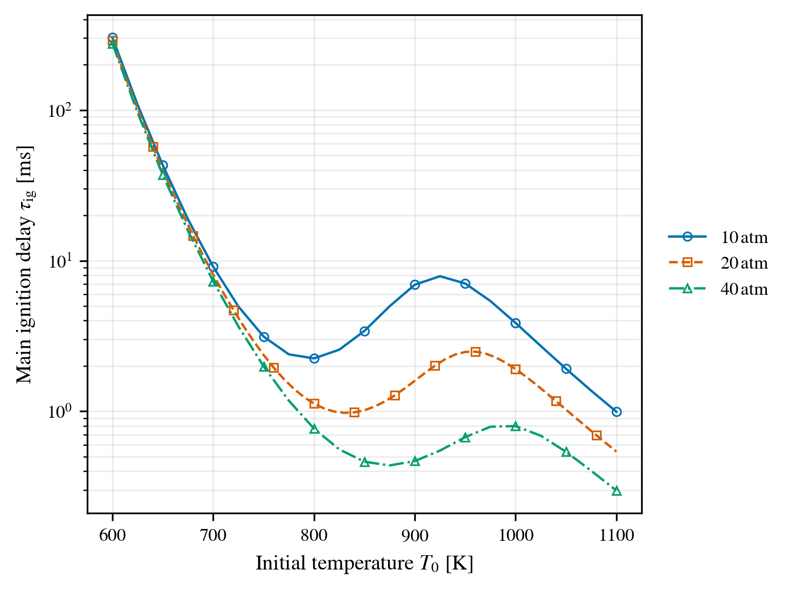

**Homogeneous ignition-delay curves.** The ascending portions demonstrate the
NTC interval in the exact study mechanism; pressure shifts the interval and
delay. This is a mechanism/design test, not a CFD accuracy reference.

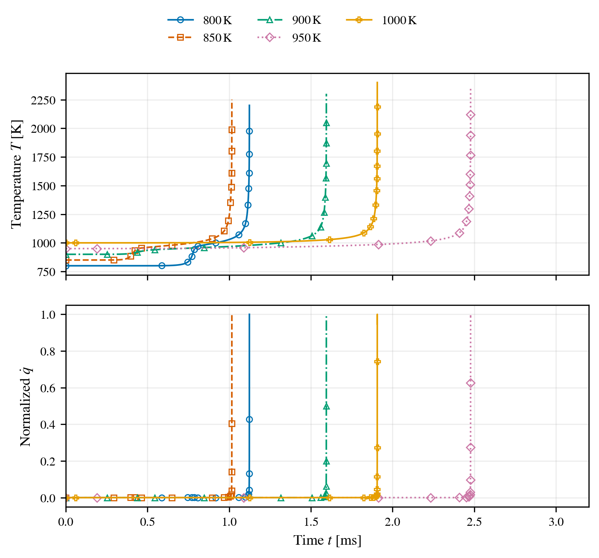

**Low-temperature and main ignition.** The separated heating events explain
why a single fixed physical step can face slow induction and a rapid runaway.
Each heat-release trace is normalized separately; amplitudes are not comparable.

The earlier [hot n-heptane posterior matrix](https://github.com/harryzhou2000/reaction-region-indicator/blob/main/studies/aposteriori_bace6_matrices/REPORT.md)
had 20 completed rows, but no common finely resolved truth and different
coarse-step end times. It demonstrated cost/robustness rather than a clear
accuracy win: at code \(1.6\times10^{-3}\), coupled and broadA capped 3/7 physical
steps, while Strang and BA-CE6 converged 7/7. Typical large-step amortized cost
was about 2 s per printed inner iteration for coupled/broadA versus 0.9–1.0 s
for Strang/BA-CE6 on 64 ranks. Those costs are configuration-specific.

## Ignition plus front: physical preparation and reference trajectory

The goal is to put a narrow diffusion-active reacting interface and a broader
chemically sensitive ignition kernel in the **same** one-dimensional domain.
Use a 10 mm closed tube, 1200 cells (\(8.333\,\mu\mathrm m\)), periodic transverse
width \(25\,\mu\mathrm m\), initially 20 atm and zero velocity. Streamwise walls
reflect waves; boundary interaction is intentional. This is not a free-flame
speed problem and the seeded interface is not an exact steady flame.

The fresh stoichiometric mixture before preparation is

$$
Y_{\mathrm{N_2}}=0.7192878080,\quad
Y_{\mathrm{O_2}}=0.2185055960,\quad
Y_{\mathrm{nC_7H_{16}}}=0.0622065960.
$$

Its preparation-temperature profile is

$$
T_{\rm prep}(x)=750\,\mathrm K+80\,\mathrm K
\exp\left[-\left(\frac{x-7\,\mathrm{mm}}{1.8\,\mathrm{mm}}\right)^2\right].
$$

Evolve those parcels isobarically for 1.3273 ms. Separately equilibrate the
750 K fresh mixture at fixed enthalpy/pressure to make the burned seed. Blend
prepared and burned compositions **and enthalpy**, using a smooth transition:

$$
\xi=\operatorname{clip}\left(\frac{x-2\,\mathrm{mm}}{0.2\,\mathrm{mm}}+\frac12,0,1\right),
\quad w=\xi^3(10-15\xi+6\xi^2),
$$

$$
Y(x)=(1-w)Y_b+wY_a(x),\qquad
\mathfrak h(x)=(1-w)\mathfrak h_b+w\mathfrak h_a(x).
$$

Here \(a,b\) mean aged and burned, and \(\mathfrak h\) is mixture specific enthalpy,
not the pressure sensor. Recover temperature from \((\mathfrak h,p,Y)\) with
Cantera; interpolate the common \(T/Y\) table in the solver and derive density
and conservative energy through its EOS. No arbitrary radical mass fractions
are inserted. The actual initial kernel maximum is **1278.41 K**, while the
burned seed is about **2605.52 K**; 750–830 K is the preparation range, not the
final CFD initial-temperature range.

Full Strang/ESDIRK2 completes a 0–25 μs pilot and a verified restart continuation
to 40 μs, with code ceiling \(10^{-4}\) (0.263852 μs). The first run has 95/95
converged physical steps; the continuation adds 62/62. The comparison uses
P1 FV, corrected reactive transport, `rhsFPPMode=2`, 10–400 inner iterations,
pseudo-CFL ramp 1→100 in ten iterations and density stopping ratio \(10^{-3}\).
The combined profile history removes the overlapped restart tail.

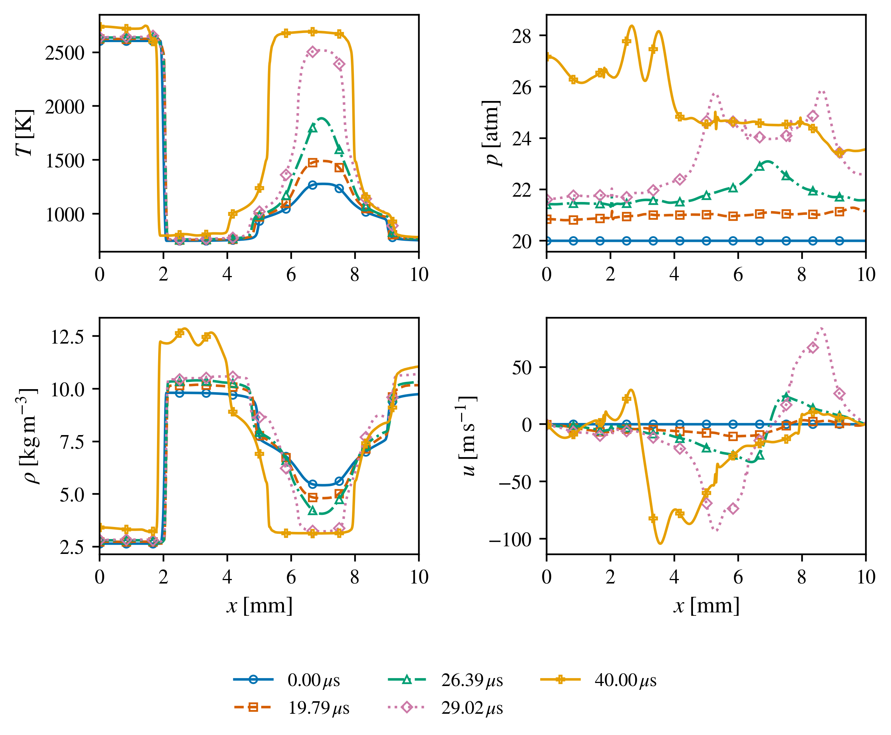

**Small-step full-Strang trajectory through 40 μs.** Temperature, pressure,
density and velocity separate the reacting interface near 2 mm from kernel
runaway near 7 mm. Expansion and pressure waves show this is not a homogeneous
constant-volume reactor. These profiles are a practical baseline, not exact truth.

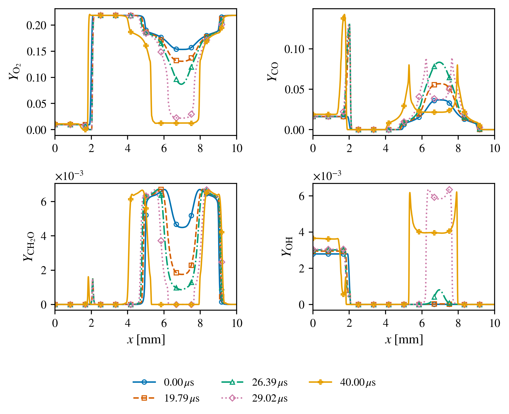

**Species evolution on the same slices.** Oxygen consumption, formaldehyde
loss, evolving CO and increased OH identify the main kernel reaction. Most
original fuel was already transformed by preparation, so fuel alone is a poor
runaway marker.

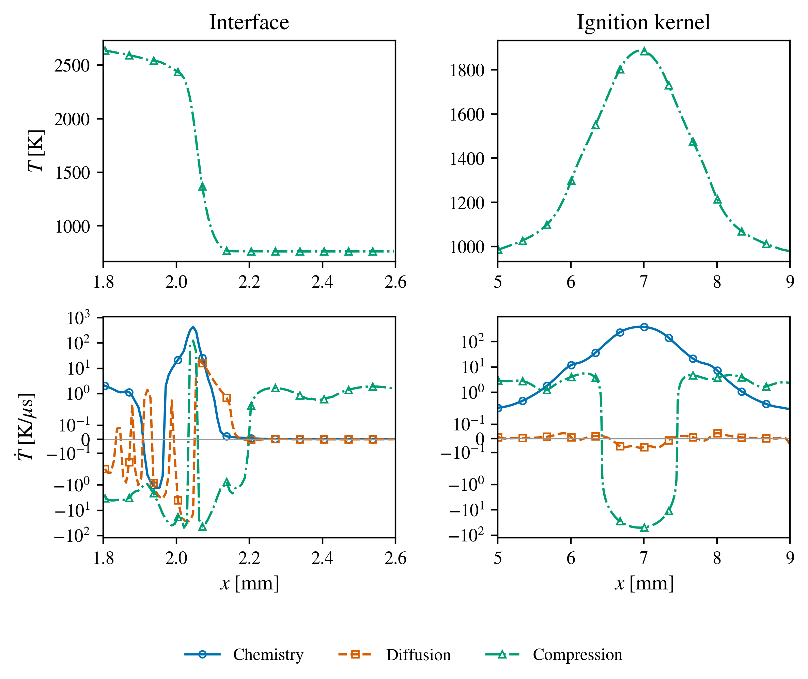

**Cell-mean budget estimates near the runaway.** Molecular diffusion matters
locally at the narrow interface; chemical heating and flow compression/expansion
dominate much of the kernel. These offline estimates motivate regional splitting,
but do not prove causality by removing transport from the CFD.

## Short-window comparison: interface and ignition errors

Every comparison starts from the **same saved step-90 state at
23.74670185 μs**, ends at 32 μs, and uses serial 64-rank execution on `cs`.
The provisional reference advances that restart with Strang at code
\(5\times10^{-5}\) (0.131926 μs), 63 physical steps and 126 converged stages.
It refines only the short window; it does not remove error accumulated before
the common restart or establish spatial convergence.

Define interface \(I=[1,3)\) mm (240 cells) and ignition kernel \(K=[3,10]\) mm
(840 cells). On this uniform grid, for either region \(R\),

$$
E_{\rm mean}^{R}=\frac1{N_R}\sum_{i\in R}|T_i-T_{i,\rm ref}|,\qquad
E_{\rm max}^{R}=\max_{i\in R}|T_i-T_{i,\rm ref}|.
$$

Errors are endpoint differences in kelvin at fixed spatial cells. No front
alignment is applied; displacement of a steep interface contributes to error.
The kernel includes its cooler shoulders, not only the hottest reacting cells.
Mean error is not signed bias, and a small mean can hide a large local maximum.

**What does zero error mean?** In these temperature bar charts, the zero is
defined by the Strang \(\Delta t_{\rm code}=5\times10^{-5}\) endpoint profile,
not by an exact solution or Cantera reactor. Thus \(\Delta T_i=T_i-T_{i,\rm ref}\).
An exactly zero mean or maximum absolute difference means every sampled
temperature in that region matches the reference at 32 μs; positive and
negative errors cannot cancel. It says nothing by itself about other fields,
earlier times, or agreement with the continuum solution. The reference has
zero error against itself by construction. Rounded displayed zeros need not
mean bitwise identity.

**What is the dotted “reference refinement” line?** It is the same regional
mean or maximum absolute temperature difference, but between the two Strang
controls at code steps \(10^{-4}\) and \(5\times10^{-5}\). Both start from the
same checkpoint, on the same mesh, and end at 32 μs. This measures sensitivity
to halving the reference timestep. It is not a fourth/fifth method's result,
not a convergence tolerance, and **not the unknown error of the finer run**.
The plot legend now explicitly names the two Strang steps.

| Dotted-line quantity | Interface [K] | Ignition kernel [K] |
|---|---:|---:|
| Mean absolute Strang step-halving difference | 7.66 | 1.52 |
| Maximum absolute Strang step-halving difference | 183.29 | 30.12 |

A bar below the dotted line is closer to the fine reference than the coarser
Strang control is; it is not thereby proven more physically accurate. Two
resolutions alone neither establish an asymptotic order nor provide a rigorous
error bound. No Richardson correction or extrapolated truth is used here.

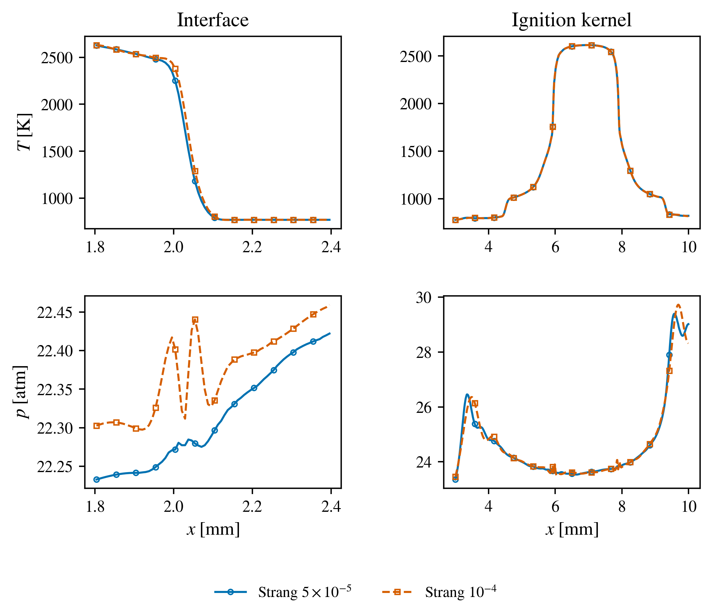

**Reference sensitivity at 32 μs.** Strang at \(10^{-4}\) versus \(5\times10^{-5}\)
differs by interface mean/max **7.66/183.29 K**, and kernel mean/max
**1.52/30.12 K**. This is an empirical refinement difference, not a rigorous
error bound, and prevents overinterpreting small improvements.

### Matched actual code step \(4\times10^{-4}\)

All four methods use seven full steps of 1.055409 μs and a common final
shortened step: eight physical steps and sixteen implicit stages. Physical
CFL 500 does not clip their histories. The earlier CFL-200 runs with the same
nominal ceiling had different actual steps and are kept separately in the
study report, not mixed into this table.

| Treatment | Interface mean / max [K] | Kernel mean / max [K] | Stages converged / capped | Wall [min] |
|---|---:|---:|---:|---:|
| Coupled | 18.04 / 293.91 | 44.13 / 684.48 | 16 / 0 | 16.34 |
| Strang | 19.43 / 575.75 | 11.60 / 346.22 | 16 / 0 | 7.69 |
| broadA | 18.45 / 365.36 | 14.20 / 298.20 | **14 / 2** | 38.61 |
| Balance | **16.85** / 378.28 | **10.54 / 251.70** | 16 / 0 | 8.96 |

The broadA endpoint is shown diagnostically: one physical step contains two
capped stages, so its errors are not accepted as fully converged evidence.
Balance has no snapped fully coupled cells in the last frozen field: **2.0%
mixed, 98.0% Strang**, mean \(1-\chi=0.00701\). broadA has 1.33% coupled,
16.08% mixed and 82.58% Strang, mean \(1-\chi=0.06951\). These are whole-domain
cell fractions, not fractions of heat release or runtime.

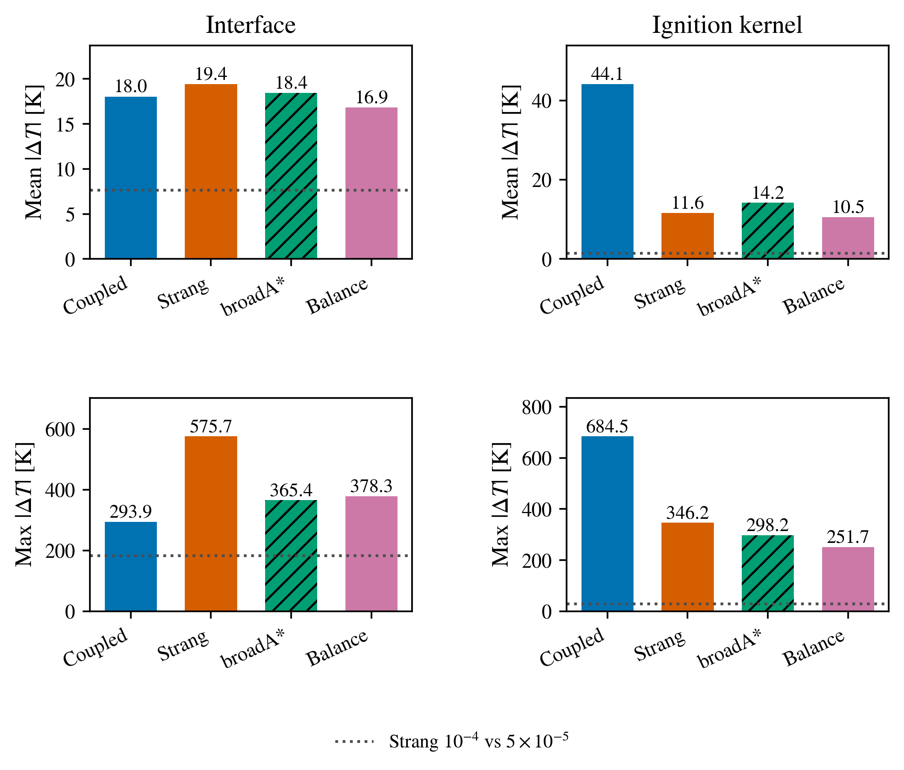

**The key regional error comparison.** Hatched broadA bars denote capped
stages. Dotted levels are the separate reference-refinement differences.
Here \(\Delta T=T-T_{\rm ref}\); the zero baseline is agreement with the fine
Strang endpoint, not exact physical truth. Balance reduces the kernel mean
error by about 76% and its maximum by about
63% relative to coupled, but coupled has the smallest interface maximum.

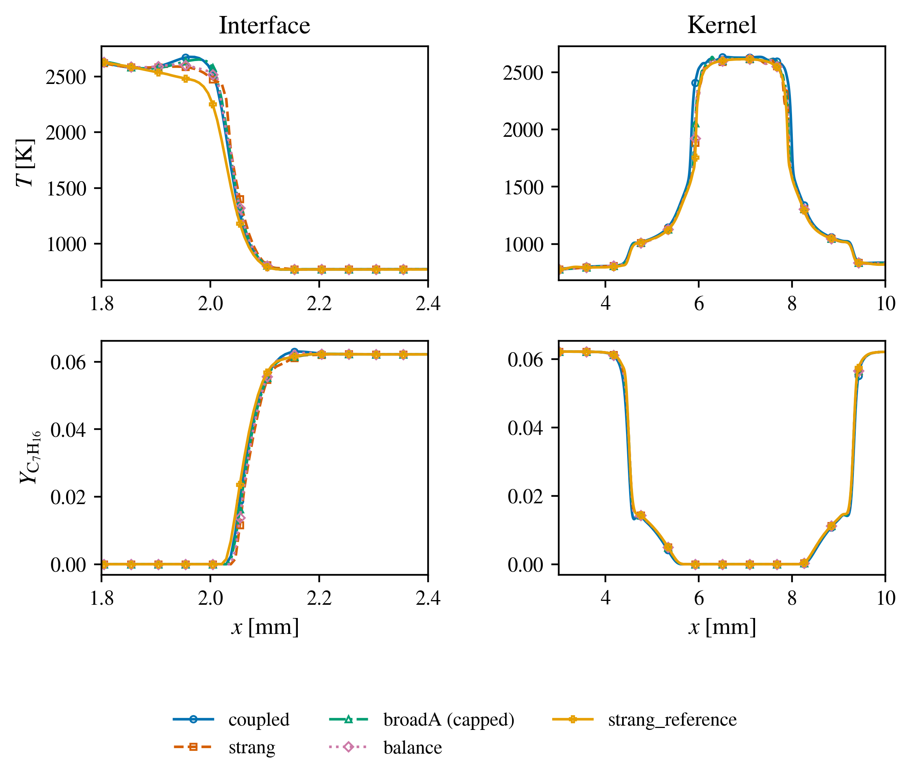

**Temperature and fuel at the matched endpoint.** The interface and kernel
are separately enlarged; the fine Strang curve is the provisional reference.
Localized peak errors arise near steep fronts and kernel shoulders.

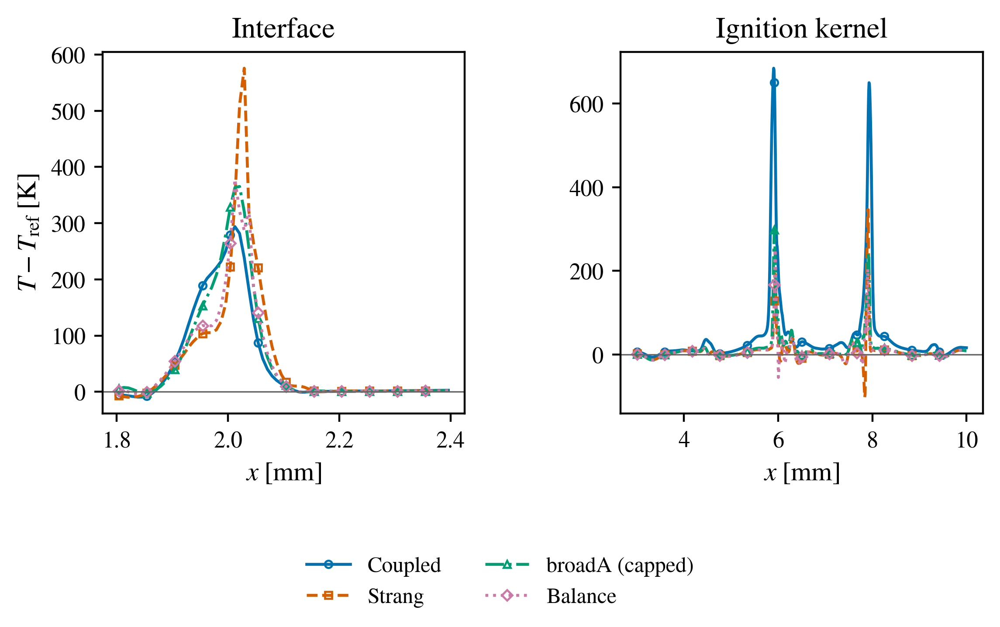

**Signed spatial error, not only summary norms.** Coupled's kernel mismatch
is broad enough to increase the mean strongly; interface shifts give narrow
positive/negative error structures. A better mean does not imply every cell
is closer to the reference.

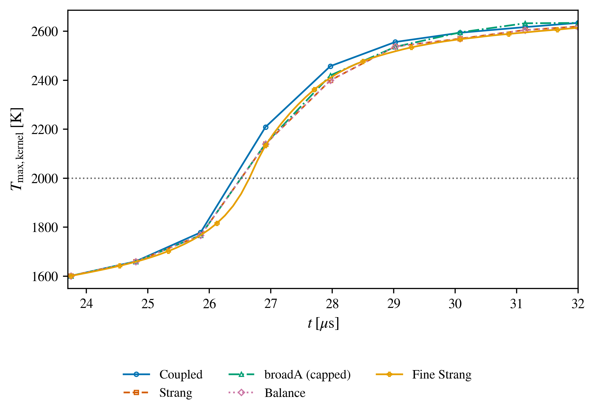

**Kernel maximum through the restart window.** The dotted 2000 K line is a
convenient spatial marker, not the homogeneous peak-heating ignition definition.
Crossings are interpolated between saved steps and inherit cadence uncertainty.

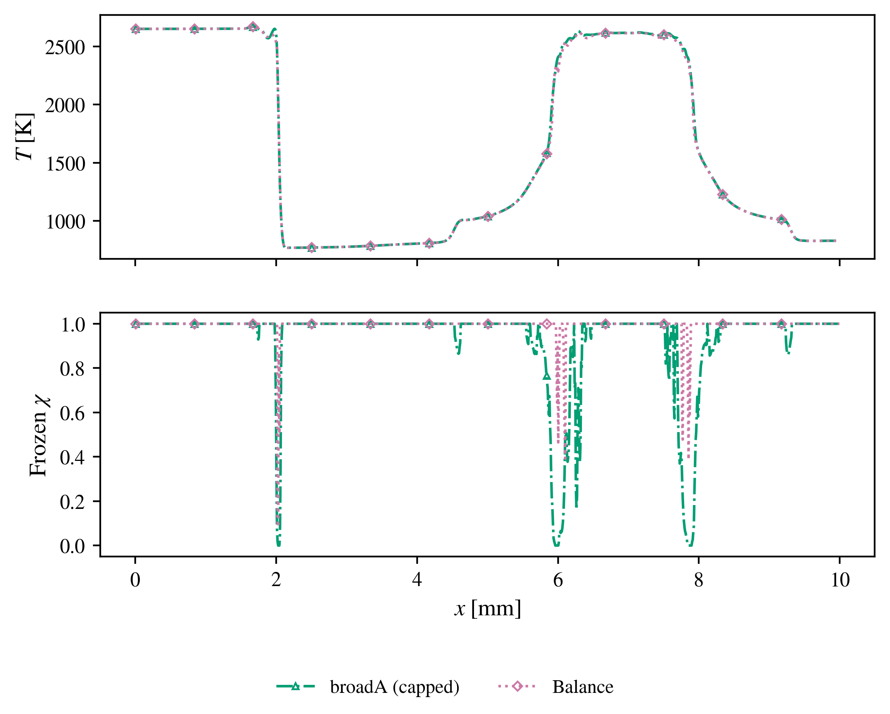

**Final temperature and last frozen selector.** Balance restricts mixing much
more than broadA. The selector was evaluated at the start of the final shortened
step; it is not a new a-priori evaluation of the endpoint at the full nominal step.

At \(2\times10^{-4}\), all three original treatments converge: coupled,
Strang and broadA have interface means **18.40, 17.21, 23.29 K** and kernel
means **9.15, 4.12, 3.56 K**. BroadA is therefore not uniformly better as the
step decreases. Balance has not been run at that smaller step.

### Why these results motivate Balance, but do not finish validation

The strongest present result is a regional tradeoff: coupled has much worse
kernel accuracy at matched large step, while Strang has a worse interface
maximum. Balance reduces both kernel norms relative to coupled and both
interface norms relative to Strang, with every stage converged. Its runtime
is about 17% above Strang and 45% below coupled in this one comparison.

However, Balance's mean-error gains over Strang are only 2.58 K at the
interface and 1.06 K in the kernel, smaller than the corresponding reference
refinement differences. Coupled still wins interface maximum error. The
candidate and older controls also use different executable hashes, although
the isolated patch adds mode 3 without changing old modes; no repeated-run
timing distribution is available. This is a promising matched-step result,
**not a universal or reference-independent superiority claim**.

### Reserved \(8\times10^{-4}\) results

All numerical cells below remain placeholders until terminal reduction,
restart identity, actual timestep histories and stage convergence are checked.
The intended step is 2.110818 μs with physical CFL 1000; four steps would reach
the endpoint if unclipped. No half-step smoke result substitutes for this test.

| Treatment | Numerical assessment | Interface mean / max | Kernel mean / max | Convergence / wall |
|---|---|---|---|---|
| Coupled | Failure observed; terminal reduction pending | — | — | — |
| Strang | Pending integration | — | — | — |
| broadA | Pending integration | — | — | — |
| Balance | Pending integration | — | — | — |

**Execution-only update, 03:47 UTC 29 September:** the monitor observed coupled
exit 134 after about 52.9 minutes, following a Cantera UV-state-recovery error
and `ChemicalSource.cpp:757` assertion. The serial launcher advanced to Strang.
No completed coupled endpoint or accuracy number is inferred. This note is not
a continuously refreshed queue dashboard; the three remaining rows retain
placeholders in this curated edition even if their live status later changes.

**Reserved figures:** matched endpoint profiles, interface/kernel mean and
maximum errors, actual timestep history, and convergence/runtime at
\(8\times10^{-4}\). No empty axes or fabricated zero-error curves are drawn.

## What should be tested next

1. Complete the already-authorized larger-step comparison and retain failed
   or capped rows visibly. Do not optimize the selector against failed outputs.
2. Refine the common-window reference once more, preferably with a second
   converged temporal treatment, before claiming small Balance-vs-Strang wins.
3. Replay Balance on the H2/O2 flame/detonation snapshot controls before any
   posterior extension. It must not trade away broadA's useful flame band.
4. Check threshold robustness around the selected nice values, with fixed
   masks and metrics. A narrow “winning” coefficient is not sufficient.
5. Keep equal-step accuracy primary. Timing supports a possible benefit here,
   but chemistry kernels, load and inner convergence still confound broad
   efficiency claims. No extra run is authorized by this reporting list.

## Provenance and local reproduction

The [study manifest](https://github.com/harryzhou2000/reaction-region-indicator/blob/main/studies/nheptane_two_scale_strang/RUN_MANIFEST.md) and
[frozen curation evidence](https://github.com/harryzhou2000/reaction-region-indicator/blob/main/studies/nheptane_two_scale_strang/results/report_curation/evidence.json)
record source hashes, all compact inputs, regional metrics, flame coverage and
the 52-row detonation table. Base solver commit:
`b7cb11e7d53b24346c63128a1a2db335b4d0ac04`. Balance uses the isolated
`codex/rri-diffusion-balance` worktree with a patch that was uncommitted at build time, SHA-256
`ed2e81a38584b33c672a15126b41ac40217f8953df37b7ee8b86000db18dd614` and executable
SHA-256 `d02b034370e55c33ca4fe31e1015d5f1b82006418a452c2c713a081dc6362eda`.
It must not be described as a clean committed build. The original controls use
executable SHA-256 `198979b0ea9b8cb8ab0f5918ad7da04d0a486bc4035da998beec915aad9f0f5e`.

The Balance source is now published as DNDSR commit
`c8de3c508f87c7b67d05bfff99d6809519a084a8` on
`codex/rri-diffusion-balance`. The commit hook changed only whitespace relative
to the recorded run patch. The original patch and build hashes remain intact:
publication did not rebuild or replace the running executable.

Run from this repository with NumPy and Matplotlib installed:

```bash
python studies/nheptane_two_scale_strang/scripts/curate_reports.py
python studies/nheptane_two_scale_strang/scripts/plot_candidate.py
python studies/nheptane_two_scale_strang/scripts/plot_comparison.py
python studies/nheptane_two_scale_strang/scripts/analyze_balance.py
```

The first command regenerates dated-summary PNG/PDF figures and evidence from
compact arrays, **excluding all \(8\times10^{-4}\) posterior rows by design**.
It does not rewrite the narrative reports or start a solver. The other scripts
reproduce the trajectory, earlier comparisons and frozen selectors. The
NTC/flame figures retain their source-study reproduction instructions. No raw
VTU/VTKHDF or remote access is needed to regenerate the illustrated profiles.
