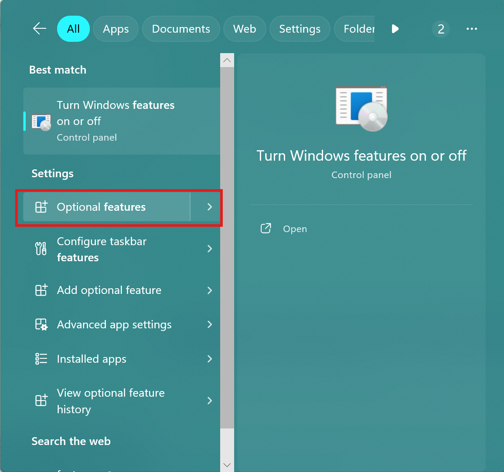
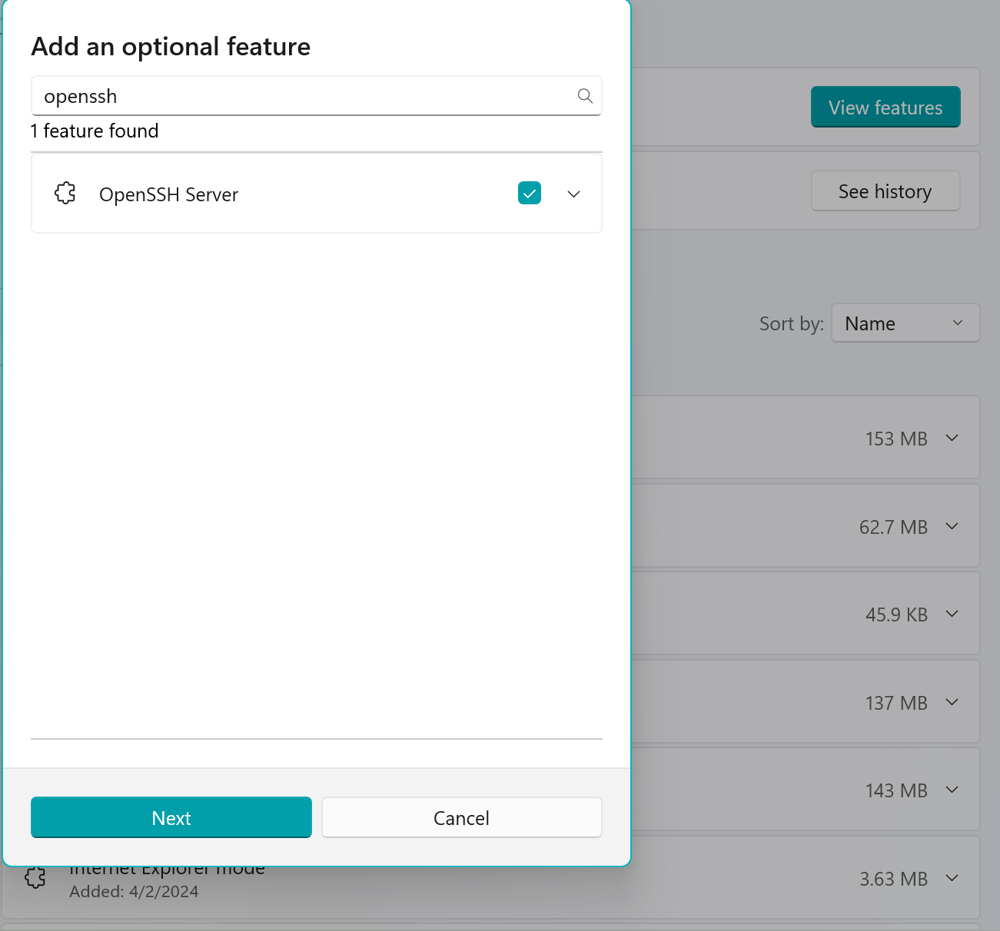

# SSH Introduction

SSH is the most commonly used development tool if you have a remote machine, like a supercomputer or a PC in your office. Plentiful introduction to SSH can be found by search engine, like [this one](https://www.geeksforgeeks.org/introduction-to-ssh-secure-shell-key). So I will only record some basic moves commonly used.

## Connect to an SSH server

SSH client is ready-to-use on modern Windows systems.

Suppose you are given a server with:

- hostname: 192.168.31.2
- user: harry
- password: pass-word

The username and password is same as the login information you use to log in that machine on the site. The hostname could be a domain name or raw IP like above.

You are supposed to be able to connect in your shell (of the client machine) with:

```bash
ssh harry@192.168.31.2
```

Ssh client program `ssh` will prompt you to enter the password, then your shell is connected to the remote machine `192.168.31.2`.

Entering the same command-line too often is inefficient, therefore we would like to give `harry@192.168.31.2` a name "office", suppose this connects to the computer in my office.

To record the ssh remote server login, edit the ssh configure file on your client machine `~/.ssh/config` (Windows Also).

``` bash
Host office
    HostName 192.168.31.2
    # Port 22 # Default is 22
    User harry

Host xxxxx
    HostName xxx
    Port xxxx
    User xxxxx
```

After this, typing

```bash
ssh office
```

does the job.

## SSH authentication with keys

You are not allowed to automatically enter the password. So, when connecting SSH with password, you must manually enter it in the console. Moreover, sometimes it might be unsafe to use password.

So, you are supposed to use a pair of public-private keys as ssh's authentication method whenever possible.

If you don't have ssh key pairs, just run in your client machine's shell:

```bash
ssh-keygen -t ed25519
```

and press enter (using all default parameters) when prompted until the end.

The parameter `-t ed25519` chooses `ed25519` as the signature algorithm. It is not recommended to use `rsa`, or you **should actually avoid using `rsa` anymore, [with the reason here](https://blog.trailofbits.com/2019/07/08/fuck-rsa/).**

After `ssh-keygen`, you have the key pair `~/.ssh/id_ed25519` and `~/.ssh/id_ed25519.pub`. **Remember only the `.pub` is the public key and is safe to show.**

Then, you have to inform the ssh server of you public key to be able to connect without a password. Run

```bash
ssh-copy-id -i ~/.ssh/id_ed25519.pub harry@192.168.31.2
# or equivilantly
ssh-copy-id -i ~/.ssh/id_ed25519.pub office
```

to automatically do the key copying. 

The tool `ssh-copy-id` is not found on Windows, so a manual copying is needed. Just run:

```bash
cat ~/.ssh/id_ed25519.pub
```

on the client machine and copy the output and append it to `~/.ssh/authorized_keys` on the remote (host) machine with:

```bash
echo "your_public_key" >> ~/.ssh/authorized_keys
```

or any text editor you like.

After this, you should be able to simply `ssh office` to enter the remote shell.

## Other parameters

```bash
Host office1
    HostName 192.168.31.3
    User harry
    Port 2222
    ServerAliveCountMax 10
    ServerAliveInterval 45
    IdentityFile ~/.ssh/id_ecdsa
    ProxyCommand "C:\Program Files\Git\mingw64\bin\connect.exe" -a none -S 1.2.3.4:1080 %h %p  
```

- `Port`: Sets the port on the host machine to connect ssh. Default is 22.
- `ServerAliveCountMax`: This sets the maximum number of keepalive messages that can be sent without receiving a response.
- `ServerAliveInterval`: This sets the interval (in seconds) between each keepalive message.
- `IdentityFile`: Explicitly sets the private key to be used.
- `ProxyCommand`: Used to connect to proxy before connecting ssh, in this case, we use a SOCKS5 proxy at `1.2.3.4:1080`.

These parameters can be passed through `-o` option in command line.

For a complete reference, see [Linux man page](https://www.man7.org/linux/man-pages/man5/ssh_config.5.html).

## SSH server on Windows

If you have a Windows machine that you want to access by SSH, you can configure it to be an SSH server. 

Before setting up a server, you should have a little network knowledge. See [Making server visible to the Internet](../../Server/PublicInternet/index.md).

OpenSSH server feature and its service can be switched on by GUI or command-line on Windows. You can [read this tutorial](https://woshub.com/connect-to-windows-via-ssh/).

Here we have a simple GUI tutorial for Windows 11.

First, install OpenSSH. Search for features from the global search and choose the `optional features` in settings. Then select `Add an optional feature` and search for `openssh`:

 

go through until the end and Windows will install OpenSSH:


