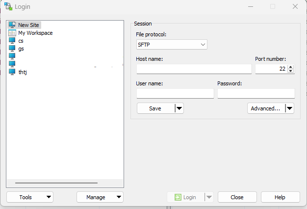
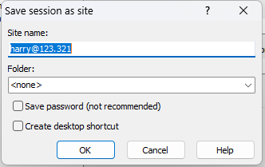
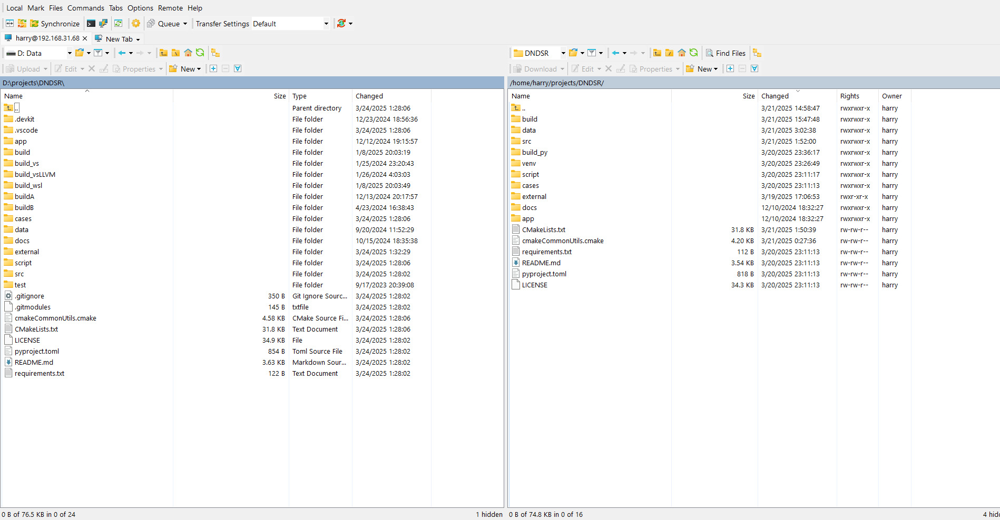
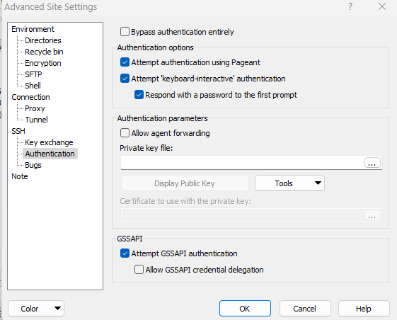
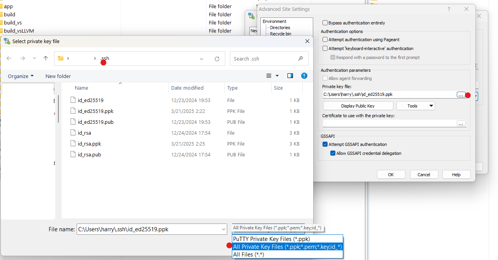

Some basic file transferring techniques used on ssh connections are introduced here.

[A introduction of using ssh connections is here](/p/ssh-intro).

Suppose you have ssh connection to some host, in the ssh `config`:

```bash
Host office
    HostName 192.168.31.2
    Port 2222 # Default is 22
    User harry
    IdentityFile ~/ssh/id_ed25519
```

Now in you client machine, you can `ssh office` into the host machine's shell and open a remote terminal. 

Of course various operations could be done over a ssh connection, including persistent connection, and using many tools to achieve arbitrary data connection.

You can actually use `ssh <destination> <command> <arguments...>` from client side to use `echo` or `tee` to do file transfer, and even add piped compression-decompression filters.

However, we will need more dedicated and robust tools for file transferring over ssh if it is done on a daily basis. Here are some options.

## Using `scp` or `rsync` command

`scp` command is often shipped with the `ssh` cli tool.

Using `scp` is just like using your typical UNIX or DOS `cp`:

```bash
scp <source> ... <target>
```

In order to express a location on a remote ssh machine, either `source` or target can be written as:

```bash
user@ip.or.domain.name.of.host:/path/to/destination
# or
name_of_host_in_config:/path/to/destination
# the path can include "~" which will be resolved as user's $HOME
name_of_host_in_config:~/path/from/home
# wildcard can be used, if you call from bash escape the "*":
name_of_host_in_config:~/\*.txt
# powershell doesn't seem to need the escape: name_of_host_in_config:~/*.txt
```

Using the connection `office` at the top of this post as example:

```bash
Host office
    HostName 192.168.31.2
    Port 2222 # Default is 22
    User harry
    IdentityFile ~/ssh/id_ed25519
```

 you can do:

```bash
# on client machine

scp -P 2222 -i ~/ssh/id_ed25519 harry@192.168.31.2:~/some_file.txt .
# or equivalently
scp office:~/some_file.txt .

scp ./some_file.txt office:~/some_file_back.txt

scp office:~/\*.txt ./txts

# use -r to recurse into directory
scp -r office:~/some_directory ./some_directory
```

On a lot of linux distributions, you can use `rsync` tool instead of `ssh` if you are synchronizing your workspace.

`rsync` is especially helpful when you want to:

- preserve modification time
- preserve file permissions like owner and group
- only update modified files (instead of transferring the same file again)

To use `rsync` to synchronize two directories, use like:

```bash
rsync -auP office:~/my_project/ ~/my_project
```

**Note the `/` at the end of source path**, omitting it will result in a `~/my_project/my_project/...` structure.

## File transfer GUI clients, `WinSCP` as example

There are GUI file management tools supporting SFTP and/or SCP protocol.

If you have a ssh server, it is likely SFTP protocol is allowed.

Using the `office` ssh connection as an example, you can use the same authentication to setup a SFTP connection and use GUI to manage you files.

On Linux, you can use some free tools:

- [FileZilla](https://filezilla-project.org/), which has been a popular FTP tool and supports SFTP
- [muCommander](https://www.mucommander.com/), a file manager supporting a lot of virtual filesystems including SFTP
- or GNOME/KDE's default file managers

FileZilla and muCommander are also available on Windows.

There is also WinSCP, which is popular on Windows. I will use WinSCP as an example to show how to manage the files on the remote `office` host.

### Password Connection

Click `NewTab`, or just opening a new window, WinSCP will spawn a `Login` dialogue window. 

Click on `New Site` and it should be like this:




Use the default `SFTP` protocol. Fill in the `Host name`, `Port number`, `User Name` and `Password` you use to login `office`.

Then click `save` to save the site configuration:



You can name the site to `office` for clarity.

Then click `Login`. If configured properly, the connection is established and WinSCP shows a dual-pane layout (if you use the default layout):



Now, drag-and-drop across local and remote filesystem, or `ctrl-c` `ctrl-v` will trigger file transfer.

### Key Connection

Recall [the key connection part of ssh tutorial](/p/ssh-intro/#ssh-authentication-with-keys), sometimes you are not allowed password authentication. 

WinSCP indeed support using key instead of password.

In `New Site` dialogue click `Advanced` and select `SSH/Authentication` tab:



Notice `Private Key File` field is initially empty. Click the dots at the right, navigate to `~/.ssh` (which is usually `C:\Users\your_windows_user_name\.ssh`), and change the file filter to `All Private Key Files`:



If you generated a OpenSSH ed25519 key pair like in [the tutorial](/p/ssh-intro/#ssh-authentication-with-keys), you will only find `id_ed25519` and `id_ed25519.pub` files in it. 

Choose the **Private Key File**: `id_ed25519` and follow the prompt to convert it into a putty format key. 

Save the generated key file `id_ed25519.ppk` (maybe in the same location) as WinSCP prompt you and select the generated .ppk file in the `Advanced/SSH/Authentication` dialogue.

Now, fill in the `Host name`, `Port number`, `User Name`, and leave the `Password` field empty. Click `Login` and it should connect.


## `sshfs` mounting

If you prefer to operate in complete commandline, or prefer to use the remote filesystem like a local one, `sshfs` is the right choice.

### Linux `sshfs` usage

Using `sshfs` on linux is like mounting the remote filesystem on a local mount point.

Using `sshfs` on Linux allows you to mount a remote file system over SSH, as if it were a local directory. Here's a step-by-step guide to get you started:

#### 1. Install sshfs

Make sure `sshfs` is installed on your system. See `sshfs --version`.

On most Linux distributions, you can install it using the package manager:

- **Ubuntu/Debian**: `sudo apt-get install sshfs`
- **Fedora/RHEL**: `sudo dnf install sshfs`
- **Arch**: `sudo pacman -S sshfs`

#### 2. Create a Mount Point

Decide on a directory where the remote file system will be mounted. For example:

```bash
mkdir ~/remote_mount
```

#### 3. Mount the Remote File System

Given the connection configuration:

```bash
Host office
    HostName 192.168.31.2
    Port 2222 # Default is 22
    User harry
    IdentityFile ~/ssh/id_ed25519
``` 

use the following command to mount the remote file system:

```bash
# note the port is not -P and identity file is not -i
sshfs -p 2222 -o IdentityFile=~/ssh/id_ed25519 harry@192.168.31.2:/remote/directory ~/remote_mount
# or if you have setup the config
sshfs office:/remote/directory ~/remote_mount
```

Note that different from `scp`, `~` is not resolved as remote `$HOME` in the remote path.

Once mounted, you can access the files at `~/remote_mount` as if they were part of your local system.

#### 4. Unmount the Remote File System

When you're done, unmount it using:

```bash
fusermount -u ~/remote_mount
```

#### 5. Notes

- `rm` on the mount point **removes remote files**! Just like local mount point. So think twice before **mounting a remote root/home directory**, or mounting on somewhere **inside a temporary directory**.
- You might notice the ownership in the mounted directory is not matching. You can use `-o idmap=user` to map all remote files to the user calling the sshfs mount command.

### Windows `sshfs` usage

sshfs uses FUSE under the hood. It is not trivial to use sshfs on windows. 

Fortunately, a splendid free solution, [SSHFS-Win](https://github.com/winfsp/sshfs-win) is present.

The readme of [SSHFS-Win](https://github.com/winfsp/sshfs-win) is quite clear. I will record some basic moves.

#### Installation

use winget:

```powershell
winget install SSHFS-Win.SSHFS-Win
```

Or manual install:

- WinFSP ([msi installer here](https://github.com/winfsp/winfsp/releases/tag/v2.0))
- SSHFS-Win ([msi installer here](https://github.com/winfsp/sshfs-win/releases))

#### Connect

Given the ssh connection config:

```bash
Host office
    HostName 192.168.31.2
    Port 2222 # Default is 22
    User harry
    IdentityFile ~/ssh/id_ed25519
```

In the Windows `Explorer`, right-click `This PC`, select `Map Network Drive`, use a path like

```
\\sshfs\harry@192.168.31.2!2022
```

and you will be prompted to enter the password.

You can use key pairs for authentication. Consult [this part of SSHFS-Win readme](https://github.com/winfsp/sshfs-win?tab=readme-ov-file#unc-syntax).

## Visual Studio Code

Visual Studio Code is able to connect to the remote server. It runs a service on the remote host and communicates with your local code frontend through ssh.

When you open a folder in a remote VSCode session, the file explorer reveals the project file tree.

You can then use either drag-and-drop, `ctrl-c`-`ctrl-v` or right-click/download to upload/download files.

Be careful when you have to operate on large files or directories, because VSCode does not reveal the progress of file transfer and the bandwidth might be suboptimal.


